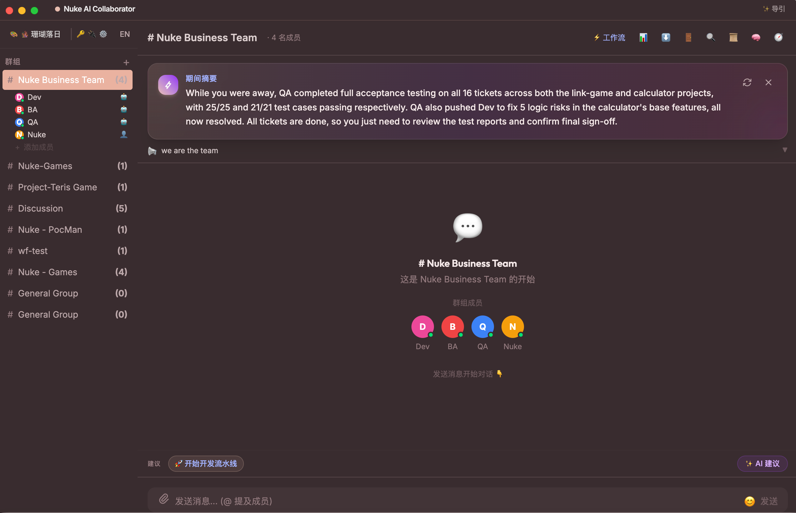

<div align="center">

# 🚀 Nuke AI Collaborator

### 给组织的「常驻 AI 研发协同团队」操作系统
### *A Resident AI Engineering Team That Appreciates Over Time.*

<p align="center">
  <a href="./README_EN.md"><b>English</b></a> |
  <a href="./README.md"><b>简体中文</b></a>
</p>

[](https://www.python.org/)
[](https://react.dev/)
[](https://fastapi.tiangolo.com/)
[](https://tailwindcss.com/)
[](https://modelcontextprotocol.io/)
[](docs/ENGINEERING-METRICS.md)
[](LICENSE)
[](https://github.com/nuke-yu/nuke-ai-collaborator/pulls)

<br/>



<br/>

> **💡 核心愿景**：**Nuke AI Collaborator** 是一个以**群组（Group）**为协作边界的开源 AI 研发协同平台。它将类似 Slack/飞书的群聊体验与多智能体执行流水线结合，让人类工程师与具有专业分工的 AI 员工（需求、开发、测试、项目管理等）同台协作，形成**「数据物理隔离、流程受控可审计、且越用越懂你」**的常驻数字工程团队。

</div>

---

## 🎬 演示视频 (Product Demos)

<table align="center" width="100%">
  <tr>
    <td align="center" width="50%">
      <b>📹 Demo 1: 平台基础协作与多角色协同</b>
      <br/><br/>
      <a href="https://github.com/nuke-yu/nuke-ai-collaborator/blob/main/vedio/Nuke-ai-collaborator.mp4" target="_blank">
        
        <br/><br/>
        <b>▶️ 点击在线播放 Demo 1 (5.2MB MP4)</b>
      </a>
      <br/>
      <sub>展示群组讨论、多角色 AI 员工接力与共享看板</sub>
    </td>
    <td align="center" width="50%">
      <b>🐝 Demo 2: Nuke AI Swarm 多智能体集群演练</b>
      <br/><br/>
      <a href="https://github.com/nuke-yu/nuke-ai-collaborator/blob/main/vedio/Nuke-AI-swarm.mp4" target="_blank">
        
        <br/><br/>
        <b>▶️ 点击在线播放 Demo 2 (7.8MB MP4)</b>
      </a>
      <br/>
      <sub>展示多智能体并发流水线编排与任务接力实战</sub>
    </td>
  </tr>
</table>

---

## 🎯 核心价值：一支越用越值钱的数字团队

Nuke AI Collaborator 围绕**组织级协作**、**认知记忆沉淀**与**企业级安全治理**构建，让 AI 真正成为团队长期的核心生产力资产：

```
                    ┌──────────────────────────────────────────────┐
                    │          👥 真实人类 (PM / Leader)           │
                    └──────────────────────┬───────────────────────┘
                                           │ @需求拆解 / @全员
                                           ▼
┌────────────────────────────────────────────────────────────────────────────────────────┐
│ 💬 群组协作空间 (Group Private Domain · 数据与沙箱物理级隔离)                             │
│                                                                                        │
│   ┌────────────────┐      ┌────────────────┐      ┌────────────────┐                   │
│   │ 📋 AI-BA 需求官 │ ───► │ 💻 AI-Dev 工程师 │ ───► │ 🧪 AI-QA 测试官 │                   │
│   └───────┬────────┘      └───────┬────────┘      └───────┬────────┘                   │
│           │                       │                       │                            │
│           └───────────────────────┼───────────────────────┘                            │
│                                   ▼                                                    │
│               📌 共享任务看板 & 交付物 (BOARD.md / SPEC.md)                               │
│                                   │                                                    │
│           ┌───────────────────────┴───────────────────────┐                            │
│           ▼                                               ▼                            │
│ 🧠 工业级认知记忆引擎 (A-MEM)                  🛡️ 企业级安全纵深 (Security Mesh)          │
│ ├─ Episodic 经历 ➔ Semantic 常识反思           ├─ 关键写操作 / Shell 人在环审批 (HITL)     │
│ ├─ 三因子加权检索 (相关性+时效+重要度)         ├─ AST Token 级双层防命令逃逸              │
│ └─ 溯源链 + 冲突消解，记忆不腐烂               └─ 密钥/Token/PEM 自动脱敏 (Redaction)      │
└────────────────────────────────────────────────────────────────────────────────────────┘
```

### 1. 🧠 工业级认知记忆复利 (Cognitive Memory Compound)
- **经历反思与概念升华**：跳脱出单纯的文本拼接，通过 **经历记忆 (Episodic) 抽取 ➔ 概念常识 (Semantic) 反思固化**，将日常讨论与交付沉淀为领域知识。
- **三因子加权动态召回**：综合 **语义相关性 (Relevance) + 时效衰减 (Recency) + 决策重要度 (Importance)** 动态打分，并辅以冲突消解与遗忘策略，确保记忆持续清晰且不腐烂。
- **可信溯源与脱敏写入**：每条沉淀的记忆包含清晰的 A-MEM 溯源出处，并在持久化前强制过滤密钥凭据。

### 2. 👥 多角色协同与流水线接力 (Multi-Agent Relay & Workflows)
- **专业角色团队化**：内置需求分析师 (BA)、全栈开发架构师 (Dev)、测试工程师 (QA)、项目经理 (PM) 等丰富角色模板，支持通过 `SOUL.md` 与 `AGENT.md` 自由定义 Bot 性格与推理边界。
- **结构化任务推进**：支持线性接力（BA 输出 PRD ➔ Dev 编码 ➔ QA 测试验证）与复杂分支网状编排，任务状态持久化于共享看板 (`BOARD.md`)。
- **执行过程全透明**：前端提供实时 **Thinking 思考折叠**、**ReAct 动作跟踪** 与 **执行时间线抽屉 (Execution Timeline)**，执行步骤清晰可见。

### 3. 🛡️ 生产级安全纵深与人在环治理 (Enterprise HITL & Safety Mesh)
- **人在环审批门 (Human-in-the-Loop)**：涉及文件修改、代码落地、Shell 执行等关键写操作时，自动在前端弹出审批卡片，必须经由人类确认方可执行。
- **双层防逃逸 Shell 守卫**：一层正则强制阻断高危命令，二层基于 `shlex` 语法树分词深度防御，彻底拦截 Base64 变形与管道拼接绕过。
- **敏感数据自动脱敏 (Output Redaction)**：所有输出实时过滤 JWT、AWS 密钥、GitHub Token、私钥 PEM 等敏感数据。
- **子 Agent 权限衰减**：向下派生子任务时强制收紧权限，防止高危权限向下渗透扩散。

### 4. 🏰 物理级多租户隔离与原生 MCP (Physical Isolation & Native MCP)
- **真正的群物理隔离**：每个群拥有专属的独立 SQLite 数据库（`workspaces/group_X/chat.db`）与文件工作区，群组之间数据物理隔离，永不串群。
- **原生 MCP (Model Context Protocol) 跨进程架构**：独占式 MCP Collector 维持 Stdio/SSE 连接，Worker 进程轻量代理调用，提供无限横向扩展的工具生态。
- **零厂商绑定**：支持 OpenAI、Anthropic Claude、DeepSeek、本地 Ollama 等多种大模型混合配置，每个 Bot 均可按需指定最合适的模型。

---

## 💎 核心功能全景 (Features Overview)

### 💬 丝滑的群聊与富文本交互
- **现代前端架构**：基于 React 19 + Vite + Tailwind CSS v4 构建，极速响应，支持深色/浅色主题一键无缝切换。
- **专业 Markdown 渲染**：支持列表、表格、任务项、公式及 Prism 代码块折叠与一键复制。
- **富媒体与协同细节**：图片/文件拖拽上传、图片 Lightbox 全屏预览、多置顶 Pin 栏、消息撤回/编辑/草稿暂存、Emoji 表情互动与快捷键支持（`⌘K` / `Ctrl+K`）。
- **实时成员状态**：支持成员在线状态实时感知（Presence）与离线自定义自动代答（Auto-Reply）。

### 📚 四层自进化技能系统 (Self-Evolving Skills)
- **分层技能体系**：系统内置技能 (`System`) + 群组共享技能 (`Group`) + 角色私有技能 (`Bot`) + 外部技能扩展 (`External`)。
- **L4 受控自学习闭环**：Bot 可根据实际交互日志总结高频规律，自动生成技能草稿 (`Draft`)。经过人类 Code Review 确认批准后正式入库生效。

### ⏰ 定时调度与自动化巡检 (Cron Scheduler)
- **标准 Cron 调度**：内置基于 APScheduler 的定时任务引擎，支持 5 段式标准 Cron 表达式。
- **自动化运营**：可设置每日 Standup 自动总结、代码质量定时巡检、服务器健康体检与周报汇总。

---

## 🏗️ 系统架构与进程拓扑 (Architecture Topology)

Nuke AI Collaborator 采用 **微内核 + 进程分片 + 事件总线 (Event Bus)** 架构，保障高并发下的稳定与物理容灾隔离：

```
                              ┌────────────────────────────────────────┐
                              │            Web Browsers (UI)           │
                              └───────────────────┬────────────────────┘
                                                  │ WebSocket / REST API
                                                  ▼
┌────────────────────────────────────────────────────────────────────────────────────────────────────────┐
│ 🛡️ Supervisor 主进程 (main.py)                                                                         │
│ ├─ WebSocket 鉴权握手 (JWT) · 跨群组路由分发                                                          │
│ ├─ 分布式链路追踪 (W3C trace_id) · 结构化 JSON 统一日志                                               │
│ └─ Worker 与 MCP Collector 进程生命周期守护与健康探针                                                  │
└───────────────────────┬────────────────────────────────────────────────┬───────────────────────────────┘
                        │ IPC 通信 (UDS / Named Pipes, P99 < 0.2ms)       │ IPC
                        ▼                                                ▼
┌────────────────────────────────────────────────────────┐  ┌──────────────────────────────────────────┐
│ ⚙️ Worker 分片进程 × N (AI 推理与工具执行)              │  │ 🔌 MCP Collector 独占进程 (外部工具集线器)│
│ ├─ 负责各群组独立的 tool_loop_v1 状态机                │  │ ├─ 独占维护各 Stdio / SSE MCP 活跃连接    │
│ ├─ 29 类类型化事件总线 (Event Bus)                     │  │ ├─ 统一管理外部工具鉴权与 Schema 同步     │
│ ├─ 人在环 (HITL) 权限拦截与双层命令安全防护            │  │ └─ 执行预授权的 MCP 工具调用与结果回传    │
│ └─ 私有工作区与群独立 SQLite 存储 (workspaces/group_X) │  └──────────────────────────────────────────┘
└────────────────────────────────────────────────────────┘
```

---

## ⚡ 快速开始 (Quick Start)

### 方式一：一键脚本启动（最快体验）

- **macOS / Linux**:
  ```bash
  git clone https://github.com/nuke-yu/nuke-ai-collaborator.git
  cd nuke-ai-collaborator
  chmod +x start.sh
  ./start.sh
  ```

- **Windows (PowerShell / CMD)**:
  ```powershell
  git clone https://github.com/nuke-yu/nuke-ai-collaborator.git
  cd nuke-ai-collaborator
  .\start.bat
  ```

启动后在浏览器打开 **`http://localhost:5173`** 即可使用。

---

### 方式二：Docker 容器化部署

```bash
# 1. 创建本地持久化数据目录
sudo mkdir -p /var/lib/nuke-ai-collaborator/workspaces
sudo chown -R "$(id -u):$(id -g)" /var/lib/nuke-ai-collaborator

# 2. 启动预构建镜像 (支持 amd64 / arm64)
docker compose -f docker-compose.ghcr.yml up -d

# 3. 访问 http://localhost:8000 即可使用 (通过界面右上角 🔑 按钮直接配置模型 API Key)
```

---

### 方式三：手动分步安装

<details>
<summary><b>点击展开手动配置说明 (Python 3.12+ & Node 18+)</b></summary>

#### 1. 启动后端 (Backend)
```bash
cd backend
python3 -m venv venv

# macOS / Linux:
source venv/bin/activate
# Windows:
# venv\Scripts\activate

pip install -r requirements.txt
python3 -m uvicorn main:app --host 0.0.0.0 --port 8000
```

#### 2. 启动前端 (Frontend)
```bash
# 新开终端窗口
cd frontend
npm install
npm run dev
```

打开 `http://localhost:5173` 注册管理员账号并创建第一个项目协作群组。
</details>

---

## 🎯 典型应用场景 (Use Cases)

```
┌─────────────────────────────────────────────────────────────────────────────┐
│ 💡 场景 1：端到端需求接力交付                                                │
│ 人类 PM: "@BA 梳理微信扫码登录功能的 PRD 需求文档并同步到看板"               │
│   ➔ AI-BA 编写规范需求并同步至 `BOARD.md`                                   │
│   ➔ AI-Dev 认领任务并生成前后端代码方案                                     │
│   ➔ 触发 HITL 确认卡片，人类确认批准写入本地工作区                          │
│   ➔ AI-QA 自动编写单元测试并执行验证                                       │
├─────────────────────────────────────────────────────────────────────────────┤
│ 💡 场景 2：基于 MCP 生态的智能运维与巡检                                     │
│ 定时 Cron / 人类 @DevOps: "检查生产 Pod 状态与最近 1 小时错误日志"           │
│   ➔ 经 MCP 桥接 Kubernetes / Postgres 工具执行查询与分析                     │
│   ➔ 自动提取高频错误堆栈并输出修复方案                                      │
├─────────────────────────────────────────────────────────────────────────────┤
│ 💡 场景 3：长期沉淀的团队领域智库                                            │
│ 新成员入职: "@All 这个老项目的支付重试机制有什么历史设计背景？"              │
│   ➔ AI 检索群组长期认知记忆 (A-MEM)，精准提取历次重构决策与注意事项         │
└─────────────────────────────────────────────────────────────────────────────┘
```

---

## 🤝 参与共建与贡献 (Contributing)

Nuke AI Collaborator 是一个充满活力的开源项目，我们欢迎广大开发者、产品设计师和 AI 探索者共同参与建设！

### 🌈 欢迎贡献的方向：

- 🎨 **前端 UI/UX**：设计更多主题配色、动效微交互、可视化多 Agent 工作流编排画布、移动端体验优化。
- 🤖 **Bot 角色与技能生态**：贡献专业领域 Bot 角色模板（数据分析师、UI 设计师、安全审计员等）、编写实用 MCP 工具集与 Skill 插件。
- 🧠 **认知记忆与算法**：记忆向量召回、时间衰减与冲突消解算法调优、图数据库/知识图谱结合探索。
- 🔌 **企业生态集成**：飞书、钉钉、企业微信、Slack 双向 Webhook 桥接网关与企业 SSO 鉴权支持。

### 🛠️ 贡献流程：

1. **Fork** 本仓库并 Clone 到本地。
2. 创建特性分支：`git checkout -b feature/your-feature-name`
3. 编码并验证测试：`pytest` & `npm test`
4. 提交规范 Commit（无需添加 AI 签名信息）：
   ```bash
   git commit -m "feat(skills): add docker-management skill"
   ```
5. Push 到分支并提交 **Pull Request**！

---

## 🗺️ 路线图 (Roadmap)

- [x] **v1.0 架构地基**：Supervisor-Worker 分片运行时、EventBus 解耦、物理隔离存储
- [x] **v2.0 认知记忆与 MCP**：A-MEM 认知记忆链、原生 MCP 进程集线器、L4 受控自进化技能
- [x] **v2.5 企业硬化**：HITL 人在环审批、双层 Shell 命令守卫、自动密钥脱敏、Chaos 故障自愈
- [ ] **v3.0 协同进阶 (进行中)**：
  - [ ] 可视化多 Agent 流水线拖拽编排编辑器
  - [ ] 飞书 / 企微 / Slack 机器人网关双向打通
  - [ ] 知识图谱增强记忆网络 (Graph Memory)
  - [ ] 一键导出团队沉淀为独立 Agentic 技能包

---

## 📄 开源许可证 (License)

本项目采用 [MIT 许可证](LICENSE) 开源。

---

<div align="center">

**让每个团队，都拥有一支永不下班、越用越懂你的常驻 AI 研发团队。**

<br/>

🌟 **如果这个项目对你有帮助或启发，欢迎在 GitHub 上点亮一颗 Star！** 🌟

[提交 Issue 反馈](https://github.com/nuke-yu/nuke-ai-collaborator/issues) · [提交 Pull Request](https://github.com/nuke-yu/nuke-ai-collaborator/pulls) · [查看详细架构文档](docs/ARCHITECTURE.md)

</div>
