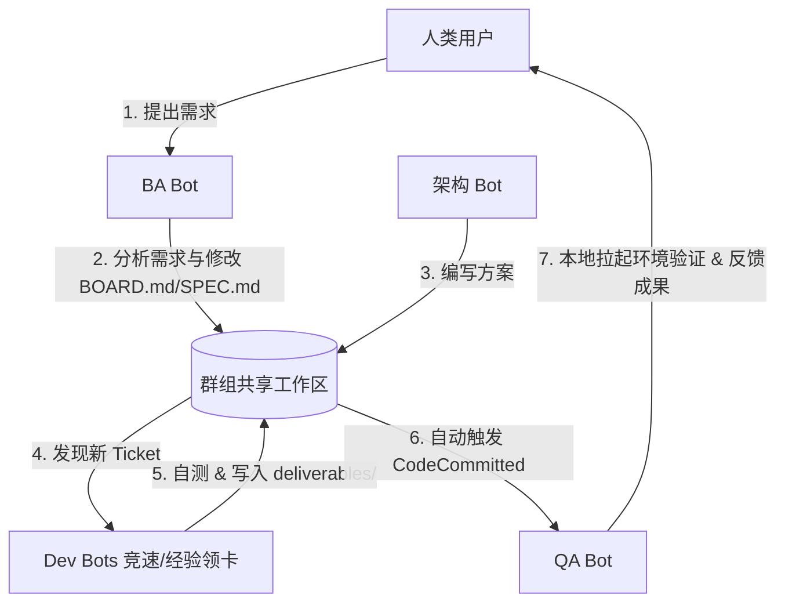

# Nuke AI Collaborator · 架构与代码审查全景汇总

本报告对后端（Python FastAPI）及前端（React + Vite + Tailwind CSS v4）的架构设计、昨日代码更新、潜在 Bug 与业务 Gap 进行了全面审查，并结合 **“基于群组内多角色 Bot（BA, 架构, 开发者, QA, 人类）项目级协同”** 的业务背景，梳理出了后续的优化 and 修复路径。

---

## 1. 业务场景模型与技术架构对齐

在当前系统中，协作模型围绕群组（Group）项目展开：


为了保障此业务链条在多 Bot 场景下安全、并发且断点续传地运行，各技术架构设计要点与其对齐关系如下：
1. **工作区重定向 (Redirection)**：看板 (`BOARD.md`)、需求 (`SPEC.md`)、接口 (`API_CONTRACT.md`) 和产出代码 (`deliverables/`) 重定向至群组，使多 Bot 信息流同步；各自私有日志与记忆保留在 Bot 私有目录，防上下文污染。
2. **读写锁 (VFS Lock)**：并发读写看板或代码文件时引入 asyncio 细粒度文件锁，确保数据一致，防止内容覆盖。
3. **动态端口分配 (Sandbox Port)**：Dev Bot 自测与 QA Bot 本地跑测试时自动拦截 8000/3000 等硬编码端口，动态分配可用随机端口并注入环境变量，防并发冲突。
4. **影子持久化与挂载 (Resumable & Mount)**：记录 session 的 WAL (Write-Ahead Logging) 支持宕机后断点续跑；在推理大循环中，每一跳动态挂载最新看板，使 Bot 拥有最新的全局协作状态感知。

---

## 2. 昨日后端代码更新与遗留缺陷审计

### 2.1 昨日更新主要修复缺陷
* `DFT-033`：建立进程级共享 `httpx.AsyncClient` 连接池，消除每次请求新建客户端引发的 TLS 握手开销及 Socket 泄露风险。
* `DFT-039` / `040`：APScheduler 调度器引进了 UTC 时区对齐，并增加 1 小时 misfire 补发宽限时间，解决重启丢失定时任务的隐患。
* `DFT-044`：权限引擎 `_matches` 参数匹配支持了嵌套结构 recursive matching，堵住了通过嵌套结构绕过安全审批的漏洞。
* `DFT-047` / `048`：修复了 WS 广播无锁安全及竞速情况下 Loser Bot 的 token 成本落库记账缺失的问题。

### 2.2 🔴 严重缺陷（NameError 导致前端 WorkspacePanel 失效）
* **文件**：[workspace/__init__.py](file:///Users/Nuke/claudeFolder/nuke-ai-collaborator/backend/workspace/__init__.py#L70) 
* **问题**：在重定向共享文件时，第 70 行代码如下：
  ```python
  return group_ws(row[0])
  ```
  但在该模块中，根本没有引入或定义 `group_ws`（其被定义在 `skills.constants`，本模块内定义的叫 `group_workspace`）。
* **影响**：前端用户只要在 Workspace 控制面板点击或修改看板 `BOARD.md` / 需求 `SPEC.md` 等共享文件，后端就会抛出 `NameError` 并返回 `500`，直接导致**前端 Workspace 面板无法加载共享文件或保存时卡死**。
* **修复**：将 `group_ws(row[0])` 修改为 `group_workspace(row[0])`。

### 2.3 🟠 核心业务 Gap（Dev Bot 领卡分配逻辑未实现）
* **文件**：[core/orchestrator.py](file:///Users/Nuke/claudeFolder/nuke-ai-collaborator/backend/core/orchestrator.py#L38-L40)
* **问题**：当前 `_on_ticket_created` 监听器只用了一行死板的逻辑分派给首个 Dev Bot：
  ```python
  target_bot = dev_bots[0]
  ```
* **影响**：完全忽略了您提出的“多卡主动抢占”、“单卡最优经验分配（Expertise Match）”以及“无匹配经验随机分派”的认领规则。
* **修复**：在此处提取 Ticket 描述信息，基于 Dev Bot 的 role / traits 关键字，使用类似 `_expertise_score` 的规则进行擅长度打分，实现智能派单算法。

### 2.4 🟡 单元测试套件重构损坏
* **文件**：`tests/test_abort_signal.py` 和 `tests/test_recovery_resume.py`
* **问题**：由于重构中 `tool_loop_v1` 的流式调用移至 `ai_service.stream`，这两个测试中针对 `tool_loop_v1.call_ai_stream_messages` 的 Mock 拦截失效，导致 12 个断点恢复与异常退出测试用例失败。
* **修复**：更新 Mock 目标，将其指向 `core.orchestration.ai_service.call_ai_stream_messages` or `ai.client.call_ai_stream_messages`。

---

## 3. 前端 UI / UX 审计与视觉重塑方案 (Wow Factor)

前端 React + Vite 代码质量极高，组件隔离良好，但由于使用了较多的默认风格，导致整体科技感与高级感略有欠缺。我们将通过以下五项视觉重塑方案（基于 Tailwind CSS v4），将 UI 质感提升至现代化 SaaS 级别：

| 模块 | 现状 | 🌟 Wow Factor 视觉重塑方案 |
| :--- | :--- | :--- |
| **整体字形** | 使用浏览器默认 System Sans-serif，字符粗糙 | **现代科技感字体 (Google Fonts)**<br>在入口处加载 **Inter** 或 **Outfit** 字体，整体排版更加高端。 |
| **Bot 头像** | 头像与人类无区分，均为单纯的首字母背景色 | **AI 专属身份角标 (Identity Ring)**<br>对 Bot 头像引入微渐变呼吸边框，并在右下角打上 `🤖` 角标，一目了然区分人类与 AI。 |
| **浮层弹窗** | 工作区、模板、工作流启动弹窗为普通暗色块背景 | **毛玻璃极简微透弹窗 (Glassmorphism)**<br>将弹窗设为 `bg-gray-900/75 backdrop-blur-md`（磨砂微透），边缘加极细金属灰度渐变线，显得极其轻盈精致。 |
| **滚动条** | 使用系统默认滚动条，在 Win 端极为突兀 | **暗色无边界轨道极窄滚动条**<br>通过 CSS 修改 `scrollbar` 宽度为 5px，滑块为半透明灰紫悬浮形态，只在滚动时隐现。 |
| **指令输出** | `run_shell` 命令结果（exit_code/stdout）为普通 Markdown 块 | **黑客帝国终端盒 (Terminal Box)**<br>对于 shell 块，采用 JetBrains Mono 字体，深黑背景配高亮绿色提示符，还原真实命令行调试质感。 |

---

## 4. 落地步骤规划

```mermaid
sequenceLine [修复与优化步骤]
    1. [修Bug] 后端：修复 `workspace/__init__.py` 里的 NameError 崩溃问题，打通前端 Workspace 文件编辑
    2. [复绿] 后端：重构 `test_abort_signal.py`/`test_recovery_resume.py` 的 mock 拦截点，使测试全绿
    3. [做业务] 后端：重写 `orchestrator.py` 的 TicketCreated 监听器，引入基于 Expertise Match 打分的 Dev Bot 抢单算法
    4. [做UI] 前端：引入 Inter 字体、模态框毛玻璃拟态、Bot 角标区分、以及命令行终端高亮美化
```
