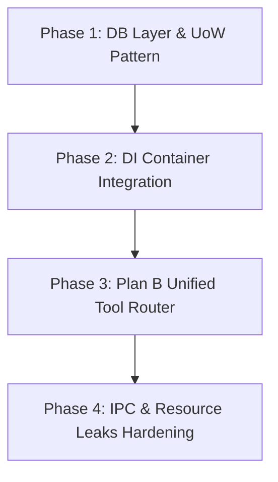

# Industrial-Grade Architectural & Design Patterns Review Report

**Date**: 2026-06-29  
**Author**: Lead Software Architect  
**Project**: Nuke AI Collaborator (Python FastAPI + Multi-Process Worker Pool + React SPA)  
**Target Standard**: Industrial-Grade Reliability, Secure Multi-Tenancy, and High Concurrency  

---

## Executive Summary

The **Nuke AI Collaborator** is currently structured as a **Supervisor-Worker-Collector split-process architecture**, running group-isolated SQLite databases and namespaced agent loops. While this architecture successfully addresses basic concurrency challenges (such as SQLite write-lock contention) and provides process-level isolation (V3 Project-Cell Isolation), the codebase still carries architectural debt from its prototyping phases. 

To achieve a true **industrial-grade design** (characterized by fault tolerance, zero resource leaks, strict security invariants, and high maintainability), the codebase must evolve. This report provides a meticulous critique of the current backend design, identifies architectural smells and design pattern violations, and maps out a concrete refactoring blueprint.

---

## 1. Process Topology & IPC Layer Critique

The system uses a single Supervisor process as the entry point and routes traffic to $K$ Worker processes and 1 MCP Collector process over Unix Domain Sockets (UDS) or Named Pipes.

```
       [ Browser WebSocket ]
                │
                ▼
       ┌─────────────────┐
       │   Supervisor    │ ◄───[ APScheduler / Central DB ]
       └────────┬────────┘
                │  UDS (length-prefixed JSON)
         ┌──────┴──────┬──────────────────────┐
         ▼             ▼                      ▼
    ┌──────────┐  ┌──────────┐        ┌──────────────┐
    │ Worker_0 │  │ Worker_1 │        │mcp-collector │
    └──────────┘  └──────────┘        └──────┬───────┘
                                             │  stdio
                                             ▼
                                      [ MCP Servers ]
```

### 1.1 Framing and Protocol Vulnerabilities
In `backend/runtime/ipc/framing.py`, the length-prefixed JSON framing protocol is defined as:
```python
async def recv_msg(reader: asyncio.StreamReader):
    header = await reader.readexactly(4)
    n = int.from_bytes(header, "big")
    if n > _MAX_FRAME:
        raise ValueError(f"IPC frame too large: {n} bytes")
    body = await reader.readexactly(n)
    data = json.loads(body)
    return parse_frame(data)
```
**Critique:**
1. **Graceful Disconnect Handling:** If a worker process exits or the socket is closed gracefully, `readexactly(4)` raises an `asyncio.IncompleteReadError`. While the caller catches this, raising exceptions for normal connection teardown is an anti-pattern. A clean EOF should return `None` or raise a custom `ConnectionClosedError` to differentiate normal termination from packet corruption.
2. **Denial of Service (DoS) via Frame Size:** Although `_MAX_FRAME` limits the incoming frame size, a malicious or corrupted frame header can specify a large size $n \le \text{MAX\_FRAME}$. The reader will then call `await reader.readexactly(n)`, which **blocks the async reader task indefinitely** until $n$ bytes arrive, causing resource starvation or timeout. A stream-based parser or timeout-bound read is required for robustness.

### 1.2 The Single MCP Collector Bottleneck
The system routes all MCP interactions through a single `mcp-collector` process.
1. **Fate Sharing:** If a single MCP server crashes, hangs, or encounters an infinite loop, it can exhaust the collector's concurrent task queue or block the collector entirely. This violates the bulkhead pattern; a crash in one group's MCP server can disrupt all other groups.
2. **Lack of Per-Server Lock:** In `mcp_collector.py`, there is a comment about `_auth_locks` protecting against OAuth race conditions, but standard MCP calls lack per-server locks or rate limiters. High-frequency calls from one bot to a shared MCP server can easily overwhelm it, blocking other bots.

---

## 2. Database Layer & Transaction Boundaries

The V3 database architecture splits storage into 1 Central DB (groups, members) and $N$ per-group private DBs, managed by a serialized writer in `backend/db/writer.py`.

### 2.1 Connection and Thread Leaks in Testing
In `db/writer.py`, we observe:
```python
def _conn_state(db_path: str) -> dict:
    ...
    # Cleanup callback to remove stale keys when the event loop is garbage collected
    def _cleanup(loop_id):
        for k in [k for k in list(_state) if k[0] == loop_id]:
            _state.pop(k, None)
    
    weakref.finalize(loop, _cleanup, lid)
```
**Critique:**
The `_cleanup` function pops keys from `_state` but **never closes the active SQLite connection (`st["conn"]`)**. When an event loop is garbage collected (highly common in unit tests), the weakref finalizer fires, removing the metadata, but the `aiosqlite` background thread and the underlying OS file handle are leaked. Over time, this leads to file descriptor exhaustion.

### 2.2 Violation of the Repository and Unit-of-Work (UoW) Patterns
The file `backend/db/queries.py` is a flat module containing dozens of functions that directly execute SQL strings. 
1. **Manual Transaction Control:** Commit operations are done manually by calling `await db.commit()` at the end of query functions.
2. **No Automatic Rollback:** If a query fails halfway through a multi-statement function, there is no `try...except` to call `await db.rollback()`. Because connections in `writer.py` are persistent, the transaction is left half-open. The next write call using that connection will inherit the uncommitted state, leading to transactional pollution.
3. **No Domain Abstraction:** The domain model is tightly coupled to raw database rows. There is no mapping to clean domain objects, violating clean architecture boundaries.

---

## 3. Security & Governance Layer

### 3.1 Plan A (Double Lane) vs. Plan B (Unified Router)
Currently, the codebase operates under **Plan A (Double Lane)**:
* Builtin/Skill/Shell tools $\rightarrow$ routed to `tool_executor.execute()`, which executes global before/after hooks (permission gating and shell denylists).
* MCP tools $\rightarrow$ routed to `ToolRouter` $\rightarrow$ `McpClientToolProvider`, which runs its own independent security gates.

```
                  [ tool_loop_v1 ]
                         │
           ┌─────────────┴─────────────┐
           ▼ (Registry has tool?)      ▼ (No)
   ┌───────────────┐           ┌──────────────┐
   │ tool_executor │           │  ToolRouter  │
   └───────┬───────┘           └──────┬───────┘
           │ (Runs Hooks)             │ (Bypasses Hooks)
           ▼                          ▼
     [ Local Tools ]           [ MCP Provider ]
```

**Critique:**
This double-lane model is a major architectural smell. It splits the security governance plane into two separate structures. If a developer accidentally registers a new provider (e.g., `ShellToolProvider`) in the `ToolRouter` without implementing hooks, it will match first and bypass the security checks completely, leading to a Remote Code Execution (RCE) vulnerability. 

An industrial-grade solution requires **Plan B (Unified Router)**, where all tool execution flows through a single router, and security hooks are applied at the router level before delegating to concrete providers.

### 3.2 State Leakage in Eviction
In `backend/permissions/engine.py`, the system tracks permission requests and temporary allowances:
```python
_once_grants: dict[tuple[int, int], list[tuple[str, str]]] = {}
_pending: dict[str, _PendingRequest] = {}
```
When a group lease is released, `cancel_pending_for_group(group_id)` is called to cancel outstanding requests in `_pending`. However, **`_once_grants` is never cleared for the group**. If groups are dynamically created and evicted, memory leaks will accumulate in `_once_grants` over time.

---

## 4. Design Pattern Violations & Code Smells

### 4.1 Global State and Singleton Abuse
The codebase relies heavily on module-level globals acting as singletons:
* `backend/executors/tool_executor.py`: `_registry`, `_before_hooks`, `_after_hooks`
* `backend/executors/tool_router.py`: `router = ToolRouter()`
* `backend/permissions/engine.py`: `_once_grants`, `_pending`

**Why this fails industrial-grade design:**
* **Test Isolation:** Tests cannot be run in parallel within the same process without contaminating global state.
* **Tight Coupling:** It is impossible to configure different permission engines or registries for different workers or groups.
* **Dependency Inversion Violation:** High-level orchestrators import low-level registries directly, instead of having their dependencies injected.

### 4.2 God Modules (Violations of Single Responsibility Principle)
* `tool_loop_v1_helpers.py` is a monolithic file with over 800 lines of helper code, mixing prompt generation, compaction triggers, WS broadcasts, and execution logic.
* `tool_executor.py` handles parsing, argument validation, alias normalization, and executing hooks simultaneously.

---

## 5. Industrial-Grade Refactoring Roadmap

To upgrade the Nuke AI Collaborator to an industrial-grade, enterprise-ready platform, we propose a 4-phase refactoring roadmap.



### Phase 1: Database Layer & Unit-of-Work (UoW) Pattern
1. **Introduce a Unit of Work Context Manager:**
   Implement a `UnitOfWork` class that wraps an `aiosqlite` connection, auto-opening transactions, committing on success, and executing `rollback()` on exceptions.
2. **Implement Repository Classes:**
   Move raw SQL queries from `queries.py` into distinct repository classes (e.g., `MessageRepository`, `MemberRepository`) that accept a database connection or a UoW instance.

```python
class UnitOfWork:
    def __init__(self, db_path: str):
        self.db_path = db_path
        self.conn = None
        self.tx = None

    async def __aenter__(self):
        self.conn = await aiosqlite.connect(self.db_path)
        # Configure WAL, busy timeout, etc.
        self.tx = await self.conn.begin()
        return self

    async def __aexit__(self, exc_type, exc_val, exc_tb):
        if exc_type:
            await self.conn.rollback()
        else:
            await self.conn.commit()
        await self.conn.close()
```

### Phase 2: Dependency Injection (DI) Container Integration
1. **Eradicate Module-Level Singletons:**
   Remove `router = ToolRouter()` and `_registry = {}`.
2. **Introduce an Application Container:**
   Instantiate registries, routing components, and database configuration inside a structured application context. Inject these instances into the `Worker` and `Supervisor` classes upon startup. This ensures strict state separation between groups and enables thread-safe concurrent testing.

### Phase 3: Plan B Unified Tool Router
1. **Hook Pipeline Migration:**
   Move before/after hook execution into the `ToolRouter` class itself. 
2. **Polymorphic Tool Providers:**
   Register `BuiltinToolProvider`, `SkillToolProvider`, `ShellToolProvider`, and `McpProxyProvider` as distinct implementations of the `ToolProvider` interface.
3. **Fail-Closed Routing:**
   Ensure that the `ToolRouter` is the **only** entry point for tool execution, and that all hook pipelines are run before any provider receives the execution request.

```python
class ToolRouter:
    def __init__(self, before_hooks: list, after_hooks: list):
        self.providers: list[ToolProvider] = []
        self.before_hooks = before_hooks
        self.after_hooks = after_hooks

    async def execute(self, name: str, arguments: dict, context: dict) -> tuple[str, bool]:
        # 1. Run before hooks (e.g., permissions, security guards)
        for hook in self.before_hooks:
            verdict = await hook(name, arguments, context)
            if verdict and verdict.get("block"):
                return f"[Blocked] {verdict.get('reason')}", True
        
        # 2. Find handling provider
        provider = next((p for p in self.providers if p.can_handle(name)), None)
        if not provider:
            return f"[Error] No provider for {name}", True
            
        # 3. Polymorphic execution
        result, is_error = await provider.execute(name, arguments, context)
        
        # 4. Run after hooks (e.g., secret redactor, output truncator)
        for hook in self.after_hooks:
            result = await hook(name, arguments, result, context) or result
            
        return result, is_error
```

### Phase 4: IPC & Resource Leaks Hardening
1. **Harden length-prefixed reading:**
   In `recv_msg`, wrap reading with `asyncio.wait_for` to prevent slow-loris style connection hangs. Return `None` gracefully on `asyncio.IncompleteReadError`.
2. **Eviction Lifecycle Hooks:**
   Update the group eviction lifecycle in the `Worker` to explicitly release resources:
   * Close the group's specific database connection.
   * Evict `_once_grants` for the group in the permission engine.
   * Terminate any active subprocesses associated with the group.

---

## Maintainer Response (2026-06-29)

This project is a **trusted-internal** tool with a deliberate, documented scope ceiling
(≤30 users / ~100 projects, single machine, process isolation as the *chosen* optimum —
not a stepping stone to distributed scaling). Several findings below are evaluated against
that scope rather than a generic "enterprise/industrial-grade" target, and two of the
headline refactors are rejected because they contradict the specific bugs the current code
was built to fix.

### Verdict per finding

| # | Finding | Verdict | Rationale |
|---|---------|---------|-----------|
| §1.1-1 | EOF raises `IncompleteReadError` is an anti-pattern | **Rejected (cosmetic)** | Caller already catches it; style preference, no behavior change. |
| §1.1-2 | Slow-loris DoS via `readexactly(n)` | **Rejected (wrong threat model)** | These UDS sockets connect *our own* Supervisor/Worker/Collector processes — no untrusted peer. `_MAX_FRAME` already caps memory. |
| §1.2-1 | Single collector violates bulkhead / fate-sharing | **Rejected (hard constraint, not debt)** | MCP must be single-process: anyio cancel scopes bind to the creating task; cross-process/task connections raise `RuntimeError`. Splitting collectors breaks the design. |
| §1.2-2 | No per-server lock / rate limit on MCP calls | **Adopted (partial)** | Added per-call timeout (see Fix 3). Per-server semaphore/rate-limit deferred — bounded by scale. |
| §2.1 | `_cleanup` leaks SQLite conn → fd exhaustion | **Rejected (overstated)** | Connection thread is `daemon=True` and each write commits per-call (WAL crash-safe); loops are long-lived in prod, churned only in tests. A weakref finalizer runs sync on a dead loop — it *cannot* `await conn.close()` anyway. |
| §2.2-2 | No rollback → transactional pollution on persistent conn | **Adopted** | Real correctness risk given the shared connection. Fixed at the `write_connect` boundary (see Fix 1). |
| §2.2 (UoW/Repository) | Introduce UnitOfWork + Repository classes | **Rejected (contradicts DFT-053 + YAGNI)** | The proposed `UnitOfWork` opens a *new* connection per operation — that reintroduces the exact "database is locked" contention the serialized single-writer was built to eliminate. (`conn.begin()` is also not an aiosqlite API.) Repository/domain-object layering is over-engineering at this scale. |
| §3.1 | Plan B unified router; double-lane = RCE | **Deferred (opinion, not a vuln)** | The "RCE" requires a developer to actively mis-register a Shell provider into the router; CLAUDE.md already documents *not* to. MCP intentionally bypasses keyword hooks (untrusted external data, gated at HIL). Single governance plane is a fair long-term direction, not an urgent bug. |
| §3.2 | `_once_grants` never cleared on eviction | **Adopted** | Verified: eviction cleared `_pending` but not `_once_grants`. Fixed (see Fix 2). |
| §4.1 | Eradicate singletons via DI container | **Rejected (YAGNI at scale)** | Test isolation is already handled by `(loop_id, db_path)` keying + per-test fresh loops; group isolation by contextvar + per-group DB. A full DI container is a large refactor with marginal benefit here. |
| §4.2 | God modules (helpers > 800 lines) | **Acknowledged (low priority)** | Fair maintainability nit; non-urgent housekeeping. |

### Fixes applied this round

1. **Write rollback** — `db/writer.py::write_connect` now rolls back on exit-by-exception
   (incl. `BaseException`/cancellation) before releasing the per-DB lock, so a query failing
   mid-transaction can't leak a half-open transaction onto the shared persistent connection.
   Test: `tests/test_db_writer.py::test_rollback_on_exception_no_tx_pollution`.
2. **Once-grant eviction** — added `permissions.engine.clear_once_grants_for_group`, called
   from `lifecycle._do_evict` alongside `cancel_pending_for_group`.
   Test: `tests/test_permissions.py::TestClearOnceGrantsForGroup`.
3. **MCP per-call timeout** — `mcp_collector._handle_call` wraps execution in
   `asyncio.wait_for(MCP_CALL_TIMEOUT_SECONDS)` (default 120s, env `NUKE_MCP_CALL_TIMEOUT_SECONDS`),
   so a hung server returns an error instead of holding a concurrency slot forever.
   Test: `tests/test_mcp_collector.py::TestCollectorCallTimeout`.
