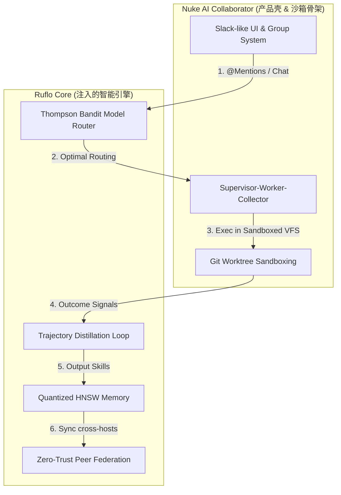

# 产品战略规划：将 Ruflo 的优势融入 Nuke AI Collaborator
**面向角色**：首席架构师 & 产品总监  
**发布时间**：2026-07-05  

---

## 一、 战略整合目标与愿景

通过将 Ruflo 的**深度智能决策体系**、**压缩记忆机制**与**节点联邦网络**，与 Nuke AI Collaborator 现有的**极致工程沙箱**及**Slack 级群组协作 UI** 进行深度融合，我们将打造行业内首个**具备生产级安全防护、自我优化学习能力、跨组织Peering的“人机共融协作平台”**。

### 核心收益 (Value Propositions)
1.  **运营成本降低 40%–60%**：摆脱对单一昂贵模型（如 Sonnet 3.5）的静态依赖，引入多臂强盗算法（Thompson Bandit）动态路由，根据任务复杂度自动调度 Haiku / DeepSeek 或者是本地 Ollama。
2.  **让 AI Bots 拥有“工程直觉”**：引入轨迹蒸馏环路（Trajectory Distillation），Bot 执行任务成功后，其解决问题的“方法论”自动转化为工作空间的 `skills/` 文件，避免重复踩坑。
3.  **支持本地/边缘化轻量部署**：引入 AgentDB 量化压缩，将向量内存减少 4x - 32x，支持在 16G 内存的普通开发机上本地流畅运行。
4.  **拓展至“跨组织代理网络”**：支持多个 Nuke Collaborator 实例在企业间（例如甲方与外包商、不同部门之间）Peering 协作，交换工单与安全信号，同时保证敏感数据不出域。

---

## 二、 4阶段产品整合路线图 (Roadmap)

### 阶段 1：构建自适应模型路由门控 (Self-Adaptive Model Gating)
*   **目标**：引入 Ruflo 的 3-Tier 模型选择与 Thompson Bandit 强盗反馈算法，对 `backend/core/orchestration/ai_service.py` 的底层调用进行重构。
*   **技术实施步骤**：
    1.  **重构 Nuke Backend `AIService`**（位于 `backend/core/orchestration/ai_service.py`）：引入路由策略类。当 `AIService.call` 收到提示请求时，首选静态规则匹配是否属于确定性 Codemod。
    2.  **实现三层决策路由**：
        *   *Tier 1 (确定性编修)*：利用本地 Python AST 解析器（或 TypeScript 编译节点）进行 var-to-const、删除 console、添加基础日志等 $0 无损改写。
        *   *Tier 2 (轻量推理)*：路由至 DeepSeek-Lite 或本地 Llama3 等低成本模型。
        *   *Tier 3 (深度推理)*：分发给 Claude 3.5 Sonnet / DeepSeek-R1 等重推理模型。
    3.  **闭环反馈机制**：任务在 `backend/core/runner.py` 执行完后，若 `pytest` 单元测试通过或 Jira 状态成功流转至 `done`，则向数据库反馈 `reward = +1.0`；若合并冲突或报错回滚，则反馈 `reward = -1.0`。
    4.  **Beta 分布参数更新**：使用贝叶斯汤普森强盗算法根据反馈动态微调参数 $\alpha$ 和 $\beta$，模型路由策略将随时间自动逼近最优解。

---

### 阶段 2：智能体运行轨迹蒸馏 (Trajectory Distillation & Skill Synthesis)
*   **目标**：解决 Bots 记忆退化、知识死板问题，将经验转化为沉淀的资产。
*   **技术实施步骤**：
    1.  **注入 Pre/Post 执行 Hooks**：在 Nuke 的 `backend/core/runner.py` 的任务管理环路中拦截 `apply_step` 的输入、调用的工具名、报错日志、以及修复前后的 git diff。
    2.  **构建 Trajectory 收集器**：当一个任务结束时，将所有 trace 组成一个 JSON 格式的执行上下文轨迹包（Trajectory Pack）。
    3.  **轨迹蒸馏 (Distillation Loop)**：
        *   若任务判定成功，后台启动一个异步分析任务（使用低成本的 Tier-2 模型），对轨迹包进行提取：“*这次 Bug 的根本原因是什么？核心解决步骤是哪几步？有何注意事项？*”
    4.  **输出 Skill 工作流资产**：将蒸馏出的知识格式化为 human-readable 的 `SKILL.md`，追加到 Group 的共享 `skills/` 软连接目录下，成为该群组所有 Bot 成员立即可查的本地长期记忆。

---

### 阶段 3：极致内存优化的本地向量存储 (Quantized HNSW Memory)
*   **目标**：替换昂贵的外部向量服务，使用高效的量化 HNSW 索引为边缘运行提速。
*   **技术实施步骤**：
    1.  **辅助/替换 ChromaDB 服务**：在 Worker 的局部数据层引入轻量级嵌入式 HNSW。
    2.  **引入量化中间件**：将 ONNX 提取的向量转换为 Int8 存储。使用 `rabitq-wasm` 或 Python 等效的二值化检索库。
    3.  **元数据混合检索**：将 Nuke 的 SQLite 群组本地库（存储聊天历史、工单信息）与量化后的 HNSW 向量索引在查询层（Query Level）进行联表混合检索（Hybrid Search），支持基于时间戳、Bot 角色标识符的精准向量过滤。
    4.  **数据安全保障**：对于高敏群组，将向量数据库和 SQLite 库在断开 WebSocket 时执行 AES-256-GCM 加密归档。

---

### 阶段 4：跨宿主零信任联邦网关 (Zero-Trust Agent Federation)
*   **目标**：从单机群聊演进为跨机构、跨部门分布式协作网络。
*   **技术实施步骤**：
    1.  **构建 Federation Gateway 模块**：在 FastAPI 暴露特殊的受控 WebSocket Peering 端口。
    2.  **Ed25519 挑战应答握手**：各部署实例产生一对非对称 Ed25519 秘钥。建立 Peering 必须通过 mTLS 双向证书或 ed25519 质询，拒绝未授权访问。
    3.  **PII 脱敏拦截插件 (Middleware)**：在 Worker 将消息转发给远程 Peering 实例前，强制经过脱敏管道，擦除特定模式的 API keys、公钥证书、内部测试 URL、人员邮箱等高敏字段。
    4.  **建立跨机工单传递**：Group A 的 Bot A 在分析完本地设计后，将编码任务以联邦工单形式投递给外部的 Host B（如外包合作商 of Nuke 实例），Host B 审核并安全执行完毕后通过 WS 隧道安全返回 diff，触发本端审查。

---

## 三、 演进架构融合设计的优缺点与应对策略

### 1. 优势 (Architectural Synergy)
*   **安全与自由度的双重平衡**：Nuke 的 Git Worktree 在前台提供了极度安全的“后悔药”（任意代码冲突可 `--abort` 还原），Ruflo 在后台提供了模型的“自适应最优解法”，两者互补，安全性与智能度同时达到最高水准。
*   **多进程鲁棒性**：Ruflo 的神经网络自学习以前是在单进程 node-mcp 内运行，高负载下可能导致阻塞；融入 Nuke 的 Supervisor-Worker 进程分片架构后，自学习计算可以被分配到独立的 Background Thread/Process 中异步计算，主 WS 通信永不卡顿。

### 2. 劣势/技术风险 (Technical Risks)
*   **状态同步复杂度**：当任务被 Worktree 重定向时，Chroma/AgentDB 的增量学习必须确保只作用于该沙箱分支对应的局部知识库，否则一旦沙箱回滚或丢弃，已经持久化到全局向量库的记忆会导致“记忆幻觉”（AI 记住了已被回滚的代码逻辑）。
    *   *应对策略*：**记忆版本化**。自学习蒸馏出的 `SKILL.md` 必须直接提交到当前 Git Worktree 分支内，合并时随代码一同合并，丢弃时随 worktree 清理一同丢弃。
*   **性能开销**：在 Python 端做 Thompson Bandit 和 HNSW 检索可能会带来开销。
    *   *应对策略*：使用 Rust 编译的 WASM 库或底层 C/C++ 动态链接库（NAPI/PyO3）来实现向量计算和强盗分布采样，保证关键路径耗时控制在毫秒级。

---

## 四、 第一阶段 (PoC) 开发验证计划

为了最低成本地验证此项战略规划的可行性，建议在下个 Sprint 中进行 **自适应模型路由 (Thompson Bandit) 的 PoC 开发**：

1.  **数据表扩张**：在中央 SQLite (`chat.db`) 引入 `model_bandit_priors` 表（包含 `model_name`、`complexity_bucket`、`alpha` (成功数)、`beta` (失败数)）。
2.  **切入路由点**：修改 `backend/core/orchestration/ai_service.py`，将写死的 `model` 参数替换为 `routing_service.get_optimal_model(prompt_complexity)`。
3.  **结果反馈回路**：在 `backend/core/runner.py` 执行完任务、通过单元测试后，调用 `routing_service.update_feedback(model, success=True)`。
4.  **监控**：在 Nuke 协作前端的群设置页面添加一个折线图，用于展示不同 Bot 随时间推移，模型路由选择的成本下降趋势。
