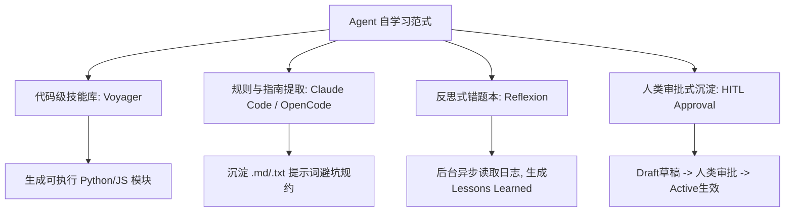

# Agent 自学与技能沉淀设计规范 (Agent Self-Learning & Spec Design)

## 1. 背景与设计初衷

在 `nuke-ai-collaborator` 多角色协同（PM, Dev, QA）开发平台中，大模型频繁参与各种高难度的软件工程任务（需求分析、Bug 修复、自动化测试等）。为了让 Agent 不断适应项目个性化的编码规范、避坑细节和业务约定，我们需要构建一套**智能体自主成长与规则沉淀机制**。

结合我们已实现的 **“工作区大文件落盘截断”** 机制（保存在当前群组工作区的 `truncated_outputs/` 目录），大模型在运行中产生的长报错、长日志不仅仅是被拦截丢弃的垃圾，而是它自主提取经验、沉淀自学知识库（Knowledge）的**真实历史证据链**。

本设计规范作为后续开发“自学技能规则”的核心指南。

---

## 2. AI 业界自学主流范式参考

在设计本系统的自学机制时，主要参考了业界以下四类成熟的系统设计哲学：



### 2.1 代码级技能库 (Code-Level Skill Library) —— NVIDIA Voyager 范式
* **核心思想**：Agent 遇到新挑战时，先尝试用 Python/JS 写一段执行逻辑。一旦测试通过，大模型用自然语言描述其功能，并将其作为“原子工具 (Atomic Tool)”持久化归档到技能库中，下一次直接检索并以代码加载执行。
* **适用点**：高频、固定的子任务流一键自动化。

### 2.2 规则与指南提取 (Rules & Guidelines) —— Claude Code / OpenCode 范式
* **核心思想**：Agent 在多轮调试中总结出项目专属的规则（如“不要使用废弃的 API X，应该使用 Y”）。Agent 自动将这些规则写入配置文件（如 `.clauderules`）。每次会话拉起时，这些规则会自动加载到 System Prompt 中。
* **适用点**：项目编码风格、依赖版本冲突避坑、接口契约约束。

### 2.3 反思式错题本 (Reflexion & Reflection) —— Reflexion 范式
* **核心思想**：系统在后台记录 Agent 的失败轨迹，在空闲时拉起反思大模型，分析为什么第 N 步出错了，并将反思备忘录存入向量数据库/内存层，在下次执行同类任务时强行注入短期记忆。
* **适用点**：大模型逻辑闭环、防死循环防御。

### 2.4 人类审批式渐进沉淀 (HITL Approvals) —— 人机协同防污染
* **核心思想**：AI 自动沉淀的技能/知识具有不确定性。必须设立一个 `draft/`（草稿区）与 `active/`（激活区）的隔离机制，只有在人类用户审查并点击 Approve 确认后，才能将规则移动到 active 目录，防止 Agent 自我污染。

---

## 3. 在 Nuke Collaborator 中的架构与规划

我们计划构建一套**融合了“规则提取（OpenCode） + 错题本反思（Reflexion） + 人类审核（HITL）”的混合自学系统**，主要包含四个步骤：

### 步骤 1：触发反思与草稿技能写入
* **触发时机**：大模型发现可复用的模式、或成功解决了一个复杂的编译/测试报错（比如分析完 `truncated_outputs/tool_result_*.log` 下的大日志之后）。
* **操作执行**：大模型自动调用 `write_file`，在当前 Bot 工作区的 `skills/learned/draft/<skill-name>.md` 写入一份包含自学前言的草稿文档，其 Frontmatter 格式规定为：
  ```markdown
  ---
  name: fix-macos-compilation-bug
  description: 解决 macOS 下编译 C-extension 报 Python.h 缺失的办法
  evidence: truncated_outputs/tool_result_a4b9c1d2.log  # 引用我们刚才落盘的截断大日志作为历史证据
  layer: learned
  status: draft
  ---
  
  ## 经验规约
  1. 必须在执行 setup.py 编译前，将 CFLAGS 指向 Xcode 的 SDK 路径。
  2. run_shell 命令前置增加：`export CFLAGS="-I$(xcrun --show-sdk-path)/usr/include"`
  ```

### 步骤 2：UI 广播与用户审批
* **广播通知**：当后台 `draft/` 目录检测到文件写入时，WebSocket 自动广播事件 `skill_draft_added`。
* **前端渲染**：在 React 前端面板弹窗或侧边栏中渲染审批组件，用户可直接对比查看 Draft 技能中的“证据链（evidence）”日志与“经验规约”。
* **审核放行**：用户审批通过后，后端将文件移动到 `skills/learned/active/`，自此技能转为 Active 状态。

### 步骤 3：动态加载与激活
* **构建 System Prompt**：在下一次 [tool_loop_v1.py](file:///Users/Nuke/claudeFolder/nuke-ai-collaborator/backend/executors/plugins/tool_loop_v1.py) 加载会话时，系统自动扫描 `skills/learned/active/` 目录。
* **注入上下文**：将这些人类确认过的优质避坑指南拼装进 `self.system_prompt_base` 的自学技能块中，让 Bot 自动遵守这些规则。

---

## 4. 后续落地计划与状态

* [x] **Milestone 1**：优化 Front-end React 侧边栏，支持展示并审批 `learned/draft/` 目录下的新技能。**(已在 SkillPanel.jsx 中实现并与后端 API 对接)**
* [ ] **Milestone 2**：开发 `evidence` 路径解析器。当用户或 AI 点击 Learned Skill 中的 `evidence` 时，系统能自动在日志面板调出并定位到当年被截断的 `truncated_outputs/` 日志文件。
* [ ] **Milestone 3**：引入后台异步 Reflexion 反思线程。每日夜间扫描 `chat.db` 的报错会话，自动提炼草稿技能到 `draft/`。
