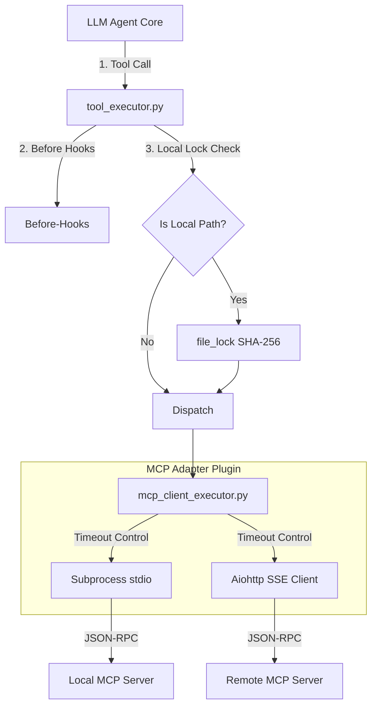

# MCP (Model Context Protocol) 与本地工具执行机制横向对比及安全威胁模型

> 最后更新：2026-06-08
> 状态：设计与选型分析 (基于本地源码审计与架构纠偏)
>
> ⚠️ **勘误（已按实现代码校正）**：本文早期版本把 nuke 的 MCP 记为「N/A（规划中）」，
> 第五节也以「未来步骤」描述了部分已落地能力。实际上 stdio 模式 MCP 客户端
> ([mcp_client.py](file:///Users/Nuke/claudeFolder/nuke-ai-collaborator/backend/executors/providers/mcp_client.py))
> 已实现：单 task 会话所有权、`allow_list`、双侧 `asyncio.wait_for` 超时、配置化 HIL、
> Claude Desktop 兼容的 `mcp_servers.json`，并已补齐**自动重连**与 **I/O 不可信防护**
> （工具投毒扫描 + 结果围栏）、remote(SSE/HTTP) 传输与 ToolListChanged 订阅。下表与 §五已据此校正；仍缺的能力（独立健康检查 / 进程树强杀）见 §五与
> [TOOL-LAYER-GAP-ANALYSIS.md](file:///Users/Nuke/claudeFolder/nuke-ai-collaborator/docs/TOOL-LAYER-GAP-ANALYSIS.md)。
>
> 🏗️ **架构演进（重要）**：MCP 已从「每 worker 各起一份」迁移到**独立 mcp-collector 进程**
> （跨群组单例，supervisor 作 bus）。worker 经 `McpProxyProvider` 转发,collector 独占所有
> 连接 + OAuth + 脱敏/围栏;**权限/HIL 留在 worker**(collector 执行 pre-authorized)。详见
> 项目内 mcp-collector 架构(`runtime/mcp_collector.py` / `executors/mcp_bridge.py` /
> `executors/providers/mcp_proxy.py`)。OAuth 为 McpAuthTool 式按需授权,回调基址 `PUBLIC_BASE_URL`
> (默认 `http://127.0.0.1:8000`),token 存 `mcp_oauth.db`。

---

## 一、 MCP 协议能力与接入演进计划 (横向对比)

本表聚焦于 **MCP 协议** 的原生支持、通道通信与服务生命周期管理。当前项目在此项上为 **✅ stdio + remote(SSE/HTTP) 客户端（运行于独立 mcp-collector 进程）**（含自动重连 + ToolListChanged 订阅 + I/O 不可信防护 + McpAuthTool 式 OAuth，见 §五/§六）。

| 维度 / 机制 | Claude Code (TypeScript)<br>[claude-code-haha-main](file:///Users/Nuke/claude-code-haha-main) | opencode (TypeScript)<br>[opencode](file:///Users/Nuke/opencode) | gsd-2 (TypeScript/Rust)<br>[gsd-2](file:///Users/Nuke/gsd-2) | openclaw (TypeScript)<br>[openclaw-main](file:///Users/Nuke/openclaw-main) | nuke-ai-collaborator (Python/SQLite)<br>[当前项目](file:///Users/Nuke/claudeFolder/nuke-ai-collaborator) |
| :--- | :--- | :--- | :--- | :--- | :--- |
| **MCP 协议角色** | **Server & Client**：<br>1. **Client**：作为客户端连接并加载外部 Server 的工具。<br>2. **Server**：通过 `entrypoints/mcp.ts` 暴露内置工具给其他 AI 宿主。 | **Client**：<br>实现完整的 MCP 客户端管理器，维护多个本地与远程连接状态。 | **Client**：<br>主要作为客户端基于项目根目录 `.mcp.json` 挂载外部工具，不涉及复杂的双向 Server 引擎。 | **Client**：<br>客户端模式，通过 Stdio 包装器连接底层服务器。 | **✅ Client（已实现，collector 进程）**：<br>独立 **mcp-collector 进程**(跨群组单例)用 `McpClientToolProvider` 连接 stdio + remote Server（每 server 一 provider，工具名前缀 `{server}__`）;worker 经 `McpProxyProvider` 走 bus 转发。暂不作 Server 端暴露。 |
| **传输协议实现** | **stdio / SSE**：<br>在客户端和服务端中都使用官方 SDK；服务端使用 `StdioServerTransport` 监听并处理来自外来客户端的同步进程管道数据。 | **stdio / SSE / StreamableHTTP**：<br>使用 `StdioClientTransport` 启动本地进程，以及 `SSEClientTransport` / `StreamableHTTPClientTransport` 执行远程通信。 | **stdio**：<br>基于 stdio 管道和 JSON-RPC 传输，对管道消息按 Tool 边界进行分发。 | **stdio / SSE**：<br>自定义 `OpenClawStdioClientTransport` 包装标准 I/O 管道，支持 stderr 数据流重定向与格式化日志记录。 | **✅ stdio + remote(SSE/HTTP)**：<br>官方 `mcp` Python SDK：`stdio_client`（env 合并保留 PATH）+ `sse_client` / `streamablehttp_client`。`_open_transport` 按 config 的 `url`/`transport` 选择，`headers` 携带鉴权。 |
| **变化通知与感知** | **环境感知重连**：<br>随主进程生命周期加载，继承 Bash/MCP 环境变量并支持热插拔重载。 | **事件总线与热更新**：<br>使用 `setNotificationHandler` 监听 `ToolListChangedNotificationSchema`，当工具集变更时拉取新定义并向 Bus 广播 `ToolsChanged` 事件。 | **静态绑定**：<br>随后台任务拉起，主要在启动期根据配置初始化加载，不支持动态热重载。 | **Stderr 订阅监听**：<br>订阅 `transport.stderr.on("data")`，一旦捕获到崩溃或数据变动日志，触发动态重连和警告上报。 | **✅ 自动重连 + ToolListChanged 订阅**：<br>会话异常死亡后 `execute()` 经 `_ensure_alive()` 按冷却+锁重连；`ClientSession(message_handler=_on_message)` 监听 `notifications/tools/list_changed`，通过 `_REFRESH` 哨兵在会话任务内安全 re-cache 工具表。详见 §五。 |
| **子进程退出控制** | **主进程回收**：<br>随主进程生命周期释放。在 `src/main.tsx` 等中使用 pgrep 递归或标准退出机制进行关联进程回收。 | **未作深层强杀**：<br>仅依赖标准 `client.close()`，子进程可能在后台残留。 | **基于 Rust ps.rs 的跨平台强杀**：<br>使用 Crate `native/crates/engine/src/ps.rs` 中的原生进程树逻辑，精准实现子进程的树状 SIGTERM 强杀，无 pgrep 外部依赖。 | **管道流感知**：<br>基于 `transport.stderr.on("data")` 辅助感知崩溃。 | **🔶 collector 进程独占回收（无树强杀）**：<br>所有 MCP 子进程现归**独立 mcp-collector 进程**（非每 worker）所有;`close()` 投 `_STOP` 哨兵让会话 task 退出，`async with` 在同 task 内回收（规避 anyio 跨 task cancel-scope）;collector 退出 `close_all()`。supervisor 管 collector 生命周期。**仍无显式进程树 SIGTERM 强杀**(npx 孙进程理论可残留)。 |
| **认证与 OAuth 机制** | **无/默认 OAuth**：<br>主要继承主应用的安全态与 credentials。 | **McpOAuthProvider**：<br>内置 `McpOAuthProvider`、`McpOAuthCallback` 与 `McpAuth` 服务，支持完整的 OAuth 客户端注册与三方鉴权流程。 | **静态配置挂载**：<br>在本地项目根目录 `.mcp.json` 中配置，不涉及复杂的用户三方认证流程。 | **OAuth 凭证解析**：<br>通过配置文件解析配置的敏感 headers 及 url 属性。 | **✅ OAuth（McpAuthTool 式）+ 静态 header/env**：<br>remote server 支持 SDK `OAuthClientProvider`（PKCE/动态注册/刷新），token 持久化于 `mcp_oauth.db`；按需授权:bot 调 `mcp_authenticate` → 授权 URL 进聊天 → 用户授权 → main `/mcp/oauth/callback` 经 bus 回 collector 完成。stdio 仍走 env，远程也可用静态 `Authorization` header。 |

---

## 二、 本地工具执行核心能力 (横向对比)

本表聚焦于 **非 MCP** 的本地工具运行控制、文件防线、参数转换与并发互斥保障，此项为当前项目的核心优势所在。

| 维度 / 机制 | Claude Code (TypeScript)<br>[claude-code-haha-main](file:///Users/Nuke/claude-code-haha-main) | opencode (TypeScript)<br>[opencode](file:///Users/Nuke/opencode) | gsd-2 (TypeScript/Rust)<br>[gsd-2](file:///Users/Nuke/gsd-2) | openclaw (TypeScript)<br>[openclaw-main](file:///Users/Nuke/openclaw-main) | nuke-ai-collaborator (Python/SQLite)<br>[当前项目](file:///Users/Nuke/claudeFolder/nuke-ai-collaborator) |
| :--- | :--- | :--- | :--- | :--- | :--- |
| **沙箱隔离机制** | **指令级白名单**：<br>限制外部工具执行 Shell，但无强隔离沙箱。 | **角色权限网关**：<br>通过安全组匹配来限制文件及环境的操作。 | **Git 干净区隔离**：<br>通过克隆干净分支进行执行，崩溃后支持一键回滚。 | **Symlink 逃逸阻断**：<br>严格检验 realpath，禁止通过软链接逃逸出安全目录。 | **Win 内存限额 + 工作区路径包含 (非真沙箱)**：<br>使用 [win_sandbox.py](file:///Users/Nuke/claudeFolder/nuke-ai-collaborator/backend/executors/plugins/win_sandbox.py) 限制 Windows 进程内存；通过 `is_relative_to` 限制工作区路径越界。但在 Unix 系统下无系统级/容器级沙箱，属于薄弱环节。 |
| **并发锁与竞态消除** | **无/进程级**：<br>依赖异步串行，未针对具体文件资源实施并发安全锁。 | **无**：<br>依赖 Effect-TS 流程并发控制，无具体资源排他锁。 | **AbortSignal 联动**：<br>利用 RPC AbortSignal 控制长时工具（如 bash），超时或主动关闭时中止任务。 | **无**：<br>依赖运行时限制最大并发数。 | **SHA-256 临时锁**：<br>通过 [lifecycle.py](file:///Users/Nuke/claudeFolder/nuke-ai-collaborator/backend/skills/lifecycle.py) 实现精细的文件级互斥，不执行 unlink 以消除 flock 竞态。 |
| **参数容错与别名机制** | **占位符追加**：<br>支持 `$ARGUMENTS` 占位，如缺失则拼接到末尾。 | **TS 管道映射**：<br>在 TS 执行端进行硬编码替换。 | **Schema 强校验**：<br>遵循 JSON Schema 标准强校验，不匹配直接报错拒绝。 | **TOOL_RESULT_MAX_CHARS**：<br>对过大输出执行 `TOOL_RESULT_MAX_CHARS` (默认 8000 字符) 截断，避免 Token 膨胀。 | **别名自动容错**：<br>通过 `_normalize_arg_aliases` 容错映射 LLM 易写错的近义参数（如 `file_path` $\rightarrow$ `path`），大幅提升调用成功率。 |
| **执行性能模型** | **单线程异步**：<br>Node.js 异步模型，密集 IO 容易排队阻塞。 | **Effect 异步并发**：<br>Effect-TS 并发管道流。 | **多进程隔离**：<br>为不同 Task 启动独立进程执行。 | **异步并发**：<br>标准的 Node.js 异步非阻塞执行。 | **多线程包裹**：<br>在 [api/workspace.py](file:///Users/Nuke/claudeFolder/nuke-ai-collaborator/backend/api/workspace.py) 中将所有同步磁盘及文件锁操作使用 `asyncio.to_thread` 包装，防止阻塞事件循环。 |

---

## 三、 nuke-ai-collaborator 真实执行优劣势审计 (Gaps & Disadvantages)

为了公允客观地评估我们的工具执行层，以下列出我们当前的优势与短板：

### 优势 (Strengths)
1. **防竞态互斥控制**：我们通过不 unlink 的 SHA-256 临时锁彻底消除了多进程/并发下的文件锁竞争态。
2. **大模型调用容错率高**：支持 `file_path`/`filepath`/`filePath` 等参数的自动归一化，大幅减少了大模型由于别名导致的调用崩溃。
3. **安全审计严格**：具备严格的正则白名单过滤（`^[a-z0-9_-]+$`）和二阶段 HIL 审批流程。
4. **MCP 单 task 会话所有权**：`stdio_client`+`ClientSession` 在专属 task 内 enter/exit，规避 anyio 跨 task cancel-scope 错误——与 opencode 同级。
5. **MCP 双侧超时 + 配置化 HIL**：caller 侧与会话循环内都包 `asyncio.wait_for`；写类工具按 `require_approval_all`/`approval_tools`/写类名启发式三级门禁经 `permissions.check` 审批。

### 劣势与缺口 (Weaknesses & Gaps)
1. **~~MCP 仅 stdio~~ → ✅ stdio + remote(SSE/HTTP) + OAuth**：均已实现，运行于独立 collector 进程（见 §五/§六）。残留仅独立健康检查 / 进程树强杀。
2. **跨平台沙箱隔离薄弱**：除了 Windows 平台下实现了 Job Object 内存硬限制外，在 macOS/Linux 下完全依赖主进程的权限运行，缺乏彻底的文件系统/进程级容器隔离。
3. **阻塞事件循环隐患**：虽然使用了 `to_thread` 包装了磁盘读写，但对于部分同步的 CPU 密集型分析（如自定义正则校验），仍有阻塞主循环的风险。
4. **~~无凭证与鉴权管理层~~ → ✅ OAuth 已实现**：remote MCP 支持 McpAuthTool 式 OAuth（授权码+PKCE+动态注册+刷新，token 存 `mcp_oauth.db`）。仍无统一的非-MCP API 密钥保管网关（范围之外）。
5. **~~MCP I/O 未做不可信处理~~ → ✅ 已修复**：server 返回的工具描述与调用结果均已做注入扫描 + 结果围栏（见 §五.2/§五.3）。

---

## 四、 MCP 协议安全威胁模型与 HIL 闸门

MCP 协议在为 AI 智能体打通工具生态的同时，引入了极高等级的安全风险。

### 1. 核心威胁模型 (Threat Model)

*   **工具毒化 (Tool Poisoning)**：
    恶意或被劫持的外部 MCP Server 在被请求 `tools/list` 时，返回包含恶意的描述或恶意 Schema，诱导大模型调用该工具以执行注入的代码。
*   **间接 Prompt 注入 (Indirect Prompt Injection)**：
    大模型通过 MCP 资源（`resources/read`）读取了不受信任的外部数据（例如包含攻击指令的网页或邮件）。这些外部指令劫持了大模型的决策，诱导大模型利用其他高权工具（如 `run_shell`）向外部发送敏感数据。
*   **供应链与凭证泄露**：
    由于 MCP 客户端信任了本地配置文件中的 Stdio 命令，一旦本地配置文件被篡改，攻击者可以利用 Stdio command 启动任意本地二进制程序执行攻击。

### 2. 我们的防护对策：HIL 人机确认闸门

基于以上威胁，本项目在接入 MCP 时将采取 **HIL（人类协同确认）零信任防线**：

```
LLM Intent  ──►  [ tool_executor ]  ──►  [ HIL 审批队列 ]  ──►  人类审批  ──►  [ McpClientExecutor ]
                                                                                   │
                                                                                   ▼
                                                                           [ 物理 MCP Server ]
```

*   **敏感分类审批**：所有的 MCP 工具在被执行前，中央路由器将通过 Namespace（`mcp::`）对其进行分类。所有涉及**写操作、数据外发或执行**的工具调用，强制在前端 UI 弹出审批卡片，未经人类确认绝对不向 MCP 服务端发送 JSON-RPC。
*   **输入内容静态扫描**：对于远程 MCP 工具返回的数据，在送回大模型 Context 之前，执行静态注入扫描（检测敏感的指令前缀、System 重置词），阻断间接注入。

---

## 五、 MCP 接入演进路线 (Evolution Path — 现状已校正)

> 本节原为「未来设计」。实际上 stdio 客户端已落地，下方「接入实现步骤」逐条标注了
> **已完成 / 部分 / 未做**，未做项即当前真实的 MCP 待办（与 `TOOL-LAYER-GAP-ANALYSIS.md` 对齐）。

整体仍采用**插件化适配器模式**（`ToolProvider` + `ToolRouter`），与现有安全/锁机制兼容。



### 接入实现步骤（含现状标注）

1.  **🔶 部分：动态客户端生命周期管理 (Subprocess Handoff)**：
    *   **已做**：`close()` 投递 `_STOP` 哨兵让会话 task 退出，`async with` 在同 task 内回收子进程；worker 退出调 `tool_router.close_all()`。
    *   **未做**：`psutil` / `kill_process_tree()` 递归 SIGTERM——npx 派生的孙进程理论上仍可能残留，需要时再补显式进程树强杀。
2.  **✅ 已完成：远端调用超时控制与 Cancel**：
    *   `session.call_tool` 在**会话循环内**包 `asyncio.wait_for(timeout=call_timeout)`；caller 侧 `execute()` 也包一层 `wait_for(asyncio.shield(future))`，双侧均不会被挂死调用拖住（`mcp_client.py:184,300`）。
3.  **🔶 部分：治理体系 (Allow-list / Deny-list)**：
    *   **已做**：`mcp_servers.json` 的 `allow_list` 在 `_cache_tools` 时按 server 端工具名过滤，只注册白名单工具，缩小攻击面。
    *   **未做**：按 bot/场景/模型的 **deny-list / 动态黑白名单两段过滤**（对标 gsd-2 `mcp-filter.ts`，见 `TOOL-LAYER-GAP-ANALYSIS #9`）。
4.  **⬜ 未做（可选）：选择性本地锁桥接 (Selective File Locking)**：
    *   设想：仅当 MCP 工具参数明确指向本地工作区路径时才触发 [lifecycle.py](file:///Users/Nuke/claudeFolder/nuke-ai-collaborator/backend/skills/lifecycle.py) 的 `file_lock`。当前 filesystem 类 MCP 与本地 `write_file` 走不同物理路径，优先级低。

### MCP 缺口（按优先级，含现状标注）

1.  **✅ 已修复：崩溃检测 + 自动重连**：`execute()` 入口调 `_ensure_alive()`——会话 task 已死时尝试一次重连，由 `_reconnect_lock` 串行化（防重连风暴）+ `_RECONNECT_COOLDOWN=5s` 冷却（防持续锤击死服务）；被 `close()` 主动关闭的 provider 不复活。(`mcp_client.py`)
2.  **✅ 已修复：工具投毒静态扫描 (Tool Poisoning)**：`_cache_tools` 对每个工具的 name+description 跑 `_scan_injection`（EN+ZH 注入模式），命中即净化描述（不把投毒文本注入 system prompt）并告警。
3.  **✅ 已修复：结果按不可信外部数据处理 (间接注入)**：`execute()` 对成功结果**无条件**包一道 `_wrap_untrusted` 围栏（标注"不可信外部数据、勿当指令"），命中注入模式再升级提示并告警；错误结果是我方文案不包裹。与 `TOOL-LAYER-GAP-ANALYSIS #2 输出脱敏`（防密钥外流，方向相反）互补。
4.  **✅ ToolListChanged 动态刷新**：`ClientSession(message_handler=_on_message)` → `notifications/tools/list_changed` → 经 `_REFRESH` 哨兵在会话任务内 re-cache（避免在读循环里做 I/O 死锁）。对标 opencode `setNotificationHandler`。
5.  **仍缺（已记于 `TOOL-LAYER-GAP-ANALYSIS`）**：独立健康检查、进程树强杀（§五步骤1）。remote(SSE/HTTP)、ToolListChanged、**OAuth（McpAuthTool 式，RFC 7591 动态注册）均已实现**——唯端到端握手需真实 OAuth server 验。

---

## 六、 使用与验证（collector 架构 + OAuth）

### 1. 配置示例（`mcp_servers.json`）
```jsonc
{
  "mcpServers": {
    "filesystem": {                         // 本地 stdio
      "command": "npx",
      "args": ["-y", "@modelcontextprotocol/server-filesystem", "./workspace"],
      "allow_list": ["read_file", "write_file"],
      "enabled": true
    },
    "remote-api": {                         // 远程 + 静态 token
      "url": "https://mcp.example.com/mcp",
      "transport": "http",                  // "http"(streamable) | "sse"
      "headers": {"Authorization": "Bearer <token>"},
      "enabled": true
    },
    "oauth-api": {                          // 远程 + OAuth（McpAuthTool 式）
      "url": "https://mcp.example.com/sse",
      "transport": "sse",
      "oauth": {"scope": "read write"},     // 出现 oauth 段即启用 OAuth
      "enabled": true
    }
  }
}
```
- 回调基址：env `PUBLIC_BASE_URL`（默认 `http://127.0.0.1:8000`）→ 回调 URL `{base}/mcp/oauth/callback`，需与授权服务器登记的 redirect 一致。
- 配置路径可用 env `MCP_SERVERS_CONFIG` 覆盖。

### 2. `mcp_authenticate` 工具的可见性
OAuth 授权由 bot 调内置工具 `mcp_authenticate(server)` 触发。它走 `tool_executor`，
但**只有 bot 的 `allowed_tools` 放开它（或 bot 未设 allowed_tools 限制=全放开）时**，
才会下发给 LLM。要让某 bot 能发起 MCP 授权，在其 `allowed_tools` 里加入 `mcp_authenticate`。

### 3. 端到端验证（需真实 OAuth MCP server）
本地无 OAuth server fixture，握手只能对真实 server 验。步骤：
1. 在 `mcp_servers.json` 配一个带 `oauth` 段的 remote server，设 `PUBLIC_BASE_URL`。
2. 让一个 bot 的 `allowed_tools` 含 `mcp_authenticate`，对它说"给 \<server\> 授权"。
3. bot 回授权 URL → 浏览器打开 → 授权 → 重定向到 `/mcp/oauth/callback`。
4. 期望：collector 完成换 token（落 `mcp_oauth.db`）→ 该 server 工具出现在后续轮次；
   重启后带 token 自动重连（SDK 刷新）。
（总线/存储/流程编排接缝均已单测；上述 1–4 是唯一需真实 server 的部分。）
