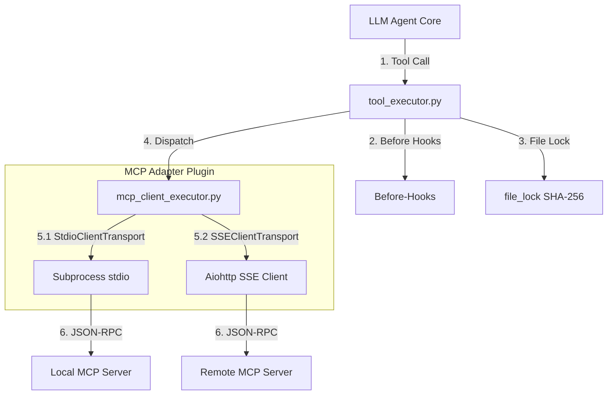

# MCP (Model Context Protocol) 与工具执行机制横向对比

> 最后更新：2026-06-07
> 状态：设计与选型分析 (基于本地源码审计)

---

## 一、 本地源码审计：智能体框架 MCP 架构横向对比表

| 维度 / 机制 | Claude Code (TypeScript) [claude-code-haha-main](file:///Users/Nuke/claude-code-haha-main) | opencode (TypeScript) [opencode](file:///Users/Nuke/opencode) | gsd-2 (TypeScript/Rust) [gsd-2](file:///Users/Nuke/gsd-2) | openclaw (TypeScript) [openclaw-main](file:///Users/Nuke/openclaw-main) | nuke-ai-collaborator (Python/SQLite) [当前项目](file:///Users/Nuke/claudeFolder/nuke-ai-collaborator) |
| :--- | :--- | :--- | :--- | :--- | :--- |
| **协议角色** | **Server & Client**： 1. **Client**：作为客户端连接并加载外部 Server 的工具。 2. **Server**：通过 `entrypoints/mcp.ts` 等使用 `StdioServerTransport` 暴露服务给其他 AI 宿主。 | **Client**： 实现完整的 MCP 客户端管理器，维护多个本地与远程连接状态。 | **Client (以 .mcp.json 配置为主)**： 通过项目下的 `.mcp.json` 进行外部 MCP 客户端工具的挂载与管理；同时也支持轻量级的自定义 MCP Server 映射。 | **Client**： 客户端模式，通过 Stdio 包装器连接底层服务器。 | **本地 Plugin (无 MCP)**： 非 MCP 架构，目前通过本地 Python 模块动态反射加载工具并生成 OpenAI Schema。 |
| **传输协议实现** | **stdio / SSE**： 在客户端和服务端中都使用官方 SDK；服务端使用 `StdioServerTransport` 监听并处理来自外来客户端的同步进程管道数据。 | **stdio / SSE / StreamableHTTP**： 使用 `StdioClientTransport` 启动本地进程，以及 `SSEClientTransport` / `StreamableHTTPClientTransport` 执行远程通信。 | **stdio / JSON-RPC**： 基于 stdio 的命令行与 JSON-RPC 传输，对管道消息按 Tool 边界进行分发。 | **stdio / SSE**： 自定义 `OpenClawStdioClientTransport` 包装标准 I/O 管道，支持 stderr 数据流重定向与格式化日志记录。 | **本地进程反射**： 不走 RPC/I/O 管道通信，使用 `importlib.util` 在主进程内直接反射实例化本地 Python 类。 |
| **工具 Schema 转换** | **动态元数据注入**： 扫描并拉取外部 Server 暴露的 tools 列表；在其服务端中，通过 `ListToolsRequestSchema` 将内置功能暴露为规范参数。 | **AI SDK dynamicTool 转换**： 通过 `convertMcpTool` 将 MCP Tool 定义转换成 Vercel AI SDK 的 `dynamicTool`，利用 `jsonSchema` 校验参数并异步执行 `callTool`。 | **Schema 转换**： 将配置的 MCP 服务器工具通过静态 Schema 挂载并转换供任务大模型识别。 | **XML 格式平铺**： 将获取的 MCP schema 参数在 Prompt 构建时转换为 XML `<available_skills>` 平铺注入。 | **OpenAI 兼容 Schema**： 通过 `get_schemas()` 提取 Python 插件中的参数说明，转换为 OpenAI 格式 function 定义。 |
| **热更新与动态感知** | **环境感知重连**： 随主进程生命周期加载，继承 Bash/MCP 环境变量并支持热插拔重载。 | **事件总线与热更新**： 使用 `setNotificationHandler` 监听 `ToolListChangedNotificationSchema`，当工具集变更时拉取新定义并向 Bus 广播 `ToolsChanged` 事件。 | **进程级绑定**： 随后台任务拉起，主要在启动期根据配置初始化加载，不支持动态重载。 | **Stderr 订阅监听**： 订阅 `transport.stderr.on("data")`，一旦捕获到崩溃或数据变动日志，触发动态重连和警告上报。 | **手动 reload()**： 通过 `reload()` 清空 before/after 钩子缓存并重新 `discover()` 扫描加载本地 `.py` 文件。 |
| **子进程退出控制** | **主进程回收**： 随主进程生命周期释放。在 `src/main.tsx` 等中使用 pgrep 递归或标准退出机制进行关联进程回收。 | **基于 pgrep 的 PID 树强杀**： 使用 `pgrep -P` 在 Unix 环境下递归查找当前 Stdio 进程的子树 PID（`descendants`），并在退出时发送 `SIGTERM` 进行清理。 | **基于 Rust ps.rs 的跨平台强杀**： 使用 Crate `native/crates/engine/src/ps.rs` 中的原生进程树逻辑，精准实现子进程的树状 SIGTERM 强杀，无 pgrep 外部依赖。 | **管道流感知**： 基于 `transport.stderr.on("data")` 辅助感知崩溃。 | **本地同步阻塞**： 直接在进程中运行，利用 [win_sandbox.py](file:///Users/Nuke/claudeFolder/nuke-ai-collaborator/backend/executors/plugins/win_sandbox.py) 在 Win 下实施 Job 内存限额。 |
| **认证与 OAuth 机制** | **无/默认 OAuth**： 主要继承主应用的安全态与 credentials。 | **McpOAuthProvider**： 内置 `McpOAuthProvider`、`McpOAuthCallback` 与 `McpAuth` 服务，支持完整的 OAuth 客户端注册与三方鉴权流程。 | **静态配置挂载**： 在本地项目根目录 `.mcp.json` 中配置，不涉及复杂的用户三方认证流程。 | **OAuth 凭证解析**： 通过配置文件解析配置的敏感 headers 及 url 属性。 | **无**： 无鉴权层，工具为本地脚本，运行于当前的进程权限空间下。 |
| **并发锁与竞态消除** | **无/进程级**： 依赖异步串行，未针对具体文件资源实施并发安全锁。 | **无**： 依赖 Effect-TS 流程并发控制，无具体资源排他锁。 | **AbortSignal 联动**： 利用 RPC AbortSignal 控制长时工具（如 bash），超时或主动关闭时中止任务。 | **无**： 依赖运行时限制最大并发数。 | **SHA-256 临时锁**： 通过 [lifecycle.py](file:///Users/Nuke/claudeFolder/nuke-ai-collaborator/backend/skills/lifecycle.py) 实现精细的文件级互斥，不执行 unlink 以消除 flock 竞态。 |

---

## 二、 各智能体框架具体实现细节

### 1. Claude Code / Claude-haha
* **协议双向支持**：既是 MCP 客户端，也充当 MCP 服务端。
  - 作为服务端：在 `entrypoints/mcp.ts`、`utils/computerUse/mcpServer.ts` 和 `utils/claudeInChrome/mcpServer.ts` 等入口中，使用 `StdioServerTransport` 搭配 `ListToolsRequestSchema` 暴露内置工具给其他 AI 主机。
  - 作为客户端：使用 `StdioClientTransport` 启动外部 MCP 服务，并通过子进程继承环境变量。
* **优点**：能够双向打通，既能作为宿主控制其他工具，也能被第三方应用集成。

### 2. opencode
* **设计哲学**：以 Effect-TS 为异步基石的纯客户端管理器。
* **子进程跟踪**：在 `packages/opencode/src/mcp/index.ts` 中，通过调用 `pgrep -P` 在 Unix 环境下递归查找当前 Stdio 进程的子树 PID（`descendants`），从而在退出时发送 `SIGTERM` 进行清理。

### 3. gsd-2 (Get Shit Done)
* **设计哲学与配置**：主要作为 MCP Client 使用，基于项目根目录下的 `.mcp.json` 来配置和集成外部工具。同时包含一个用于测试或被控的轻量级 `mcp-server.ts` 暴露自身能力。
* **Rust 进程管理器**：子进程生命周期的可靠终止不依赖 `pgrep`，而是使用 Rust 编写的原生模块 `native/crates/engine/src/ps.rs`，实现跨平台（兼容 Windows 和 Unix）的子进程树递归扫描与 `SIGTERM/SIGKILL` 强杀清理。

### 4. openclaw
* **内置客户端**：内置了非常轻量级的 MCP Client 封装，能够基于 Node.js 的 child_process 接口与本地 stdio MCP 服务建立通信。
* **Token 防膨胀机制**：在与多个 MCP 服务器通信时，如果返回的 XML/JSON 数据过大（>256KB），会自动触发截断（Truncation），并将本地路径中长物理路径缩短为相对表示，以此确保 context window 预算不被撑爆。

### 5. nuke-ai-collaborator (我们的项目)
* **实现逻辑**：我们使用 Python 开发了专属的本地插件执行器机制（[registry.py](file:///Users/Nuke/claudeFolder/nuke-ai-collaborator/backend/executors/registry.py)），并不直接暴露 MCP 接口。
* **设计优势**：
  - **精细文件锁（Anti-Inode Unlink Race）**：通过 SHA-256 临时锁消除 flock 的自毁竞态（[lifecycle.py](file:///Users/Nuke/claudeFolder/nuke-ai-collaborator/backend/skills/lifecycle.py)）。
  - **参数自动容错**：在 [tool_executor.py](file:///Users/Nuke/claudeFolder/nuke-ai-collaborator/backend/executors/tool_executor.py) 中，系统对大模型产生的错误别名参数（如 `file_path`, `contents`）进行拦截和映射，大幅降低了大模型执行工具时的报错概率。
  - **二阶段审批防线**：任何由 Bot 自学沉淀的技能都必须被强制写入 `learned/draft/`，静态审计其对 `run_shell` 或 `write_file` 的依赖后，由人类用户二次确认方可激活。

---

## 三、 未来 MCP 接入演进方案设计 (Evolution Path)

根据项目的架构设计，我们在后续阶段接入 MCP 时，将采用**插件化的适配器模式**，确保与现有安全 and 锁机制的 100% 兼容。

### 接入实现步骤

1. **新增 MCP 适配器插件**：
   在 `backend/executors/plugins/` 下创建 [mcp_client_executor.py](file:///Users/Nuke/claudeFolder/nuke-ai-collaborator/backend/executors/plugins/mcp_client_executor.py) 模块，作为 [BotExecutor](file:///Users/Nuke/claudeFolder/nuke-ai-collaborator/backend/executors/base.py) 的子类。
2. **连接与工具发现 (Connection & Discovery)**：
   在适配器的 `register_tools()` 周期中，根据系统配置，通过 `asyncio.create_subprocess_exec` 建立 `stdio` 连接，或使用 HTTP/SSE 建立与远程 MCP 节点的连接。发送 `tools/list` 报文，并将其包装为本地的 `ToolDef` 对象注册进统一的 `registry` 中。
3. **安全防线适配 (Security Alignment)**：
   - **名称隔离**：将 MCP 暴露的工具加上命名空间前缀（例如 `mcp::github::create_issue`），避免与本地平铺工具命名冲突。
   - **拦截保护**：保留并重用 `tool_executor` 的 before-hook 拦截。当检测到 `mcp::` 命名空间工具试图越界时，直接通过本地权限控制模块进行阻断。
4. **共享并发锁保护**：
   在分发执行前，适配器会根据工具涉及的文件资源计算 SHA-256 锁哈希，并调起 `file_lock`，确保跨进程的多任务工具并发安全性。
