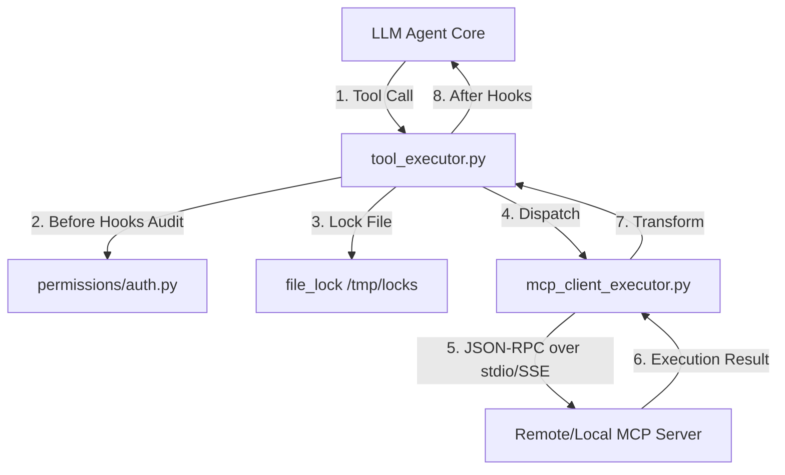

# MCP (Model Context Protocol) 与工具执行机制横向对比

> 最后更新：2026-06-07
> 状态：设计与选型分析

---

## 一、 智能体框架 MCP 与工具处理能力横向对比

| 维度 / 机制 | Claude Code (TypeScript) | opencode (TypeScript) | gsd-2 (TypeScript/Rust) | openclaw (TypeScript) | nuke-ai-collaborator (Python/SQLite) |
| :--- | :--- | :--- | :--- | :--- | :--- |
| **1. 协议支持与传输层 (Transport)** | **原生 MCP 客户端支持**： 支持标准 `stdio`（标准输入输出管道）与 `HTTP/SSE`（服务器发送事件）双轨传输协议，可直接连接各种本地/远程 MCP 服务。 | **动态加载与 URL 传输**： 通过 `cfg.skills.urls` 支持外部 HTTP/SSE 协议的 MCP 工具代理拉取与本地动态加载。 | **解耦式代理执行**： 框架核心聚焦于工作流调度与消除“上下文腐败”，其将实际的 MCP/Tool 调用委托给底层的 Agent 执行环境（如 Claude Code）。 | **内置多通道插件**： 集成 stdio 与 SSE 传输模块；支持对接第三方 MCP 聚合器（如 MCP360/Jentic）一次性接入上百个 API。 | **本地 Plugin 动态反射**： 暂无原生 MCP 协议支持。采用本地 Python 模块动态加载（[registry.py](file:///Users/Nuke/claudeFolder/nuke-ai-collaborator/backend/executors/registry.py)），通过反射注册。 |
| **2. 工具发现与 Schema 映射** | **实时 Schema 注册**： 启动时向绑定的 MCP Server 发送 `tools/list` 报文，拉取工具描述、输入参数定义并转换为 Claude 识别的 Tool Definition。 | **静态/动态双重映射**： 拉取远程 MCP 元数据后，将其翻译为本地执行的 TypeScript 函数签名并生成配置描述文件。 | **任务级别声明**： 在任务描述（spec）中声明所需的工具依赖，由底层 runtime 完成具体工具的动态解析。 | **自动 XML 包裹生成**： 将发现的所有 MCP 工具元数据直接转换为符合模型偏好的 XML 结构体注入 System Prompt。 | **OpenAI 兼容 Schema**： 由 [tool_executor.py](file:///Users/Nuke/claudeFolder/nuke-ai-collaborator/backend/executors/tool_executor.py) 中的 `get_schemas()` 统一输出标准的 OpenAI Function Schema。 |
| **3. 安全拦截与沙箱边界 (Security)** | **RCE 防御与白名单**： 允许本地技能使用 `!{bash}` 预评估，但**绝对禁止**任何远程 MCP 工具执行 Shell 脚本，防范供应链注入攻击。 | **角色权限网关**： 具备 `deny` 用户安全组，通过对不同 Agent 角色实施细粒度过滤，阻断恶意 MCP 脚本的执行。 | **Git 干净区隔离**： 工具执行在绝对干净的 Git 分支克隆中进行，即便工具发生逃逸，也可一键回滚恢复。 | **Symlink 越界阻断**： 对 MCP 工具引用的文件路径进行真实路径（`realpathSync`）越界审查，严防目录穿透。 | **多维纵深防御**： 1. 名称强制 `^[a-z0-9_-]+$` 正则白名单； 2. `is_relative_to` 绝对路径包含性防御； 3. 二阶段审批与高权工具审计（C1/C2/C3）。 |
| **4. 参数别名与校验** | **严格参数校验**： 必须严格符合拉取的 JSON Schema 定义；支持 `$ARGUMENTS` 占位替换。 | **Pipe-TS 管道流**： 利用 Effect-TS 管道流来统一校验入参并支持动态替换运行时环境占位符。 | **Schema 契约绑定**： 在原子任务级强校验传入参数的合法性，不匹配则抛出任务故障信号。 | **容量缩表与路径压缩**： 过滤超过 256KB 的 MCP 报文，同时将绝对路径中的家目录压缩为 `~/` 以节约 Token。 | **Alias 自动容错**： 通过 `_normalize_arg_aliases` 容错映射 LLM 易写错的近义参数（如 `file_path` $\rightarrow$ `path`）。 |
| **5. 并发控制与锁机制** | **单线程串行**： 对 IO 写入工具默认采用异步单线程排队，缺乏细粒度文件互斥。 | **异步并发**： 工具在多轮处理中并发发起 HTTP 请求，依赖下游服务端提供互斥保障。 | **分布式 Task 调度**： 通过独立进程拉起任务，通过工作区物理隔离避免资源争抢。 | **并发熔断器**： 限制同一 MCP Server 的最大并发数，超出时进入排队或触发错误熔断。 | **SHA-256 临时锁**： 通过 `file_lock` 实现精细的文件级互斥，锁文件保存在临时目录且**不自毁**，阻断 flock Inode 竞态。 |

---

## 二、 各智能体框架具体实现细节

### 1. Claude Code / Claude-haha
* **协议底层**：使用基于 JSON-RPC 2.0 的 MCP 官方规范。本地使用 `stdio` 连接（拉起子进程并通过 pipes 进行 JSON 交互），远程使用 `Server-Sent Events (SSE)` 建立长连接。
* **安全性控制**：采用第一方安全沙箱。对于在 Prompt 构建时执行 `!{command}` 进行预估的“本地技能”，给予了 shell 信任；而对于从第三方 MCP 注册的所有外部工具调用，严禁执行命令解释器操作，只允许其向特定的 API 发送结构化请求。
* **优点**：即插即用，生态最完善。

### 2. opencode
* **设计哲学**：倡导 HTTP 接口优于管道。它将很多远程 MCP 服务封装为 REST 风格的 API 端点。
* **局限性**：对 stdio 方式的本地 MCP 支持相对薄弱，导致很多纯本地工具（如本地的 postgres 数据库查询、本地文件查找等）必须先建立一层网络中继才能被调用。

### 3. gsd-2 (Get Shit Done)
* **设计哲学**：不直接涉足底层的协议解析，而是“站在巨人的肩膀上”。其核心引擎负责生成高度规范化的任务拆解描述（Atomic Tasks），并由下层的 runtime（可能包裹了 Claude Code 实例）直接发起 MCP 调用。
* **优点**：将繁重的工具运行与上层状态机的控制解耦，降低了核心系统的复杂度，避免了大模型因为处理长 MCP 报文而出现上下文失效的问题。

### 4. openclaw
* **内置客户端**：内置了非常轻量级的 MCP Client 封装，能够基于 Node.js 的 child_process 接口与本地 stdio MCP 服务建立通信。
* **Token 防膨胀机制**：在与多个 MCP 服务器通信时，如果返回的 XML/JSON 数据过大（>256KB），会自动触发截断（Truncation），并将本地路径中长物理路径缩短为相对表示，以此确保 context window 预算不被撑爆。

### 5. nuke-ai-collaborator (我们的项目)
* **实现逻辑**：我们使用 Python 开发了专属的本地插件执行器机制（[registry.py](file:///Users/Nuke/claudeFolder/nuke-ai-collaborator/backend/executors/registry.py)），并不直接暴露 MCP 接口。
* **设计优势**：
  - **精细文件锁（Anti-Inode Unlink Race）**：通过 SHA-256 临时锁消除 flock 的自毁竞态（[lifecycle.py](file:///Users/Nuke/claudeFolder/nuke-ai-collaborator/backend/skills/lifecycle.py)）。
  - **参数自动容错**：在 [tool_executor.py](file:///Users/Nuke/claudeFolder/nuke-ai-collaborator/backend/executors/tool_executor.py) 中，系统对大模型产生的错误别名参数（如 `file_path`, `contents`）进行拦截和映射，大幅降低了大模型执行工具时的报错概率。
  - **二阶段审批防线**：任何由 Bot 自学沉淀的技能都必须被强制写入 `learned/draft/`，静态审计其对 `run_shell` 或 `write_file` 的依赖后，由人类用户二次确认方可激活。

---

## 三、 未来 MCP 接入演进方案设计 (Evolution Path)

根据项目的架构设计，我们在后续阶段接入 MCP 时，将采用**插件化的适配器模式**，确保与现有安全 and 锁机制的 100% 兼容。

### 接入实现步骤

1. **新增 MCP 适配器插件**：
   在 `backend/executors/plugins/` 下创建 [mcp_client_executor.py](file:///Users/Nuke/claudeFolder/nuke-ai-collaborator/backend/executors/plugins/mcp_client_executor.py) 模块，作为 [BotExecutor](file:///Users/Nuke/claudeFolder/nuke-ai-collaborator/backend/executors/base.py) 的子类。
2. **连接与工具发现 (Connection & Discovery)**：
   在适配器的 `register_tools()` 周期中，根据系统配置，通过 `asyncio.create_subprocess_exec` 建立 `stdio` 连接，或使用 HTTP/SSE 建立与远程 MCP 节点的连接。发送 `tools/list` 报文，并将其包装为本地的 `ToolDef` 对象注册进统一的 `registry` 中。
3. **安全防线适配 (Security Alignment)**：
   - **名称隔离**：将 MCP 暴露的工具加上命名空间前缀（例如 `mcp::github::create_issue`），避免与本地平铺工具命名冲突。
   - **拦截保护**：保留并重用 `tool_executor` 的 before-hook 拦截。当检测到 `mcp::` 命名空间工具试图越界时，直接通过本地权限控制模块进行阻断。
4. **共享并发锁保护**：
   在分发执行前，适配器会根据工具涉及的文件资源计算 SHA-256 锁哈希，并调起 `file_lock`，确保跨进程的多任务工具并发安全性。
