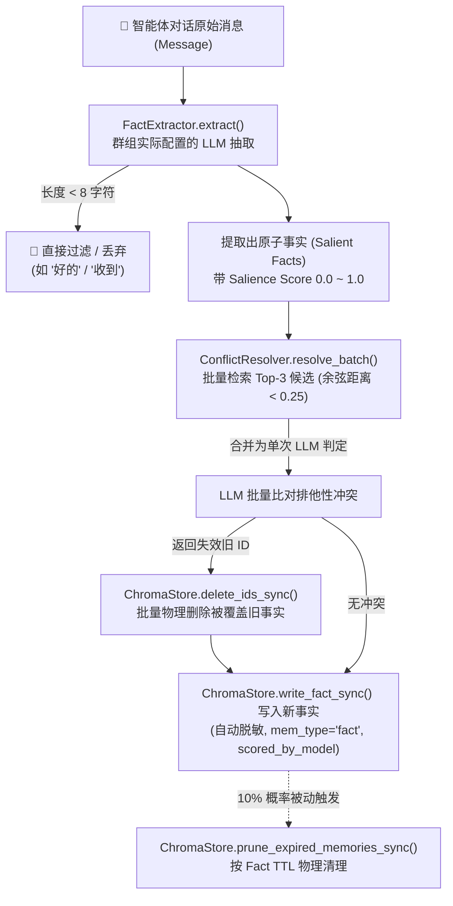
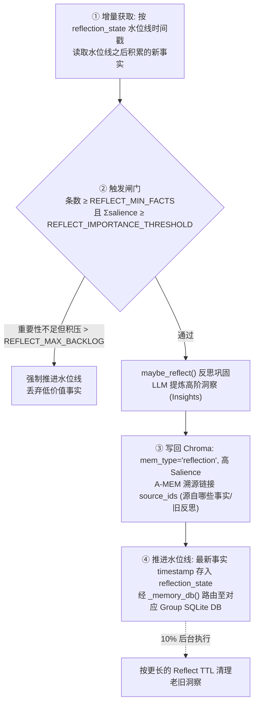
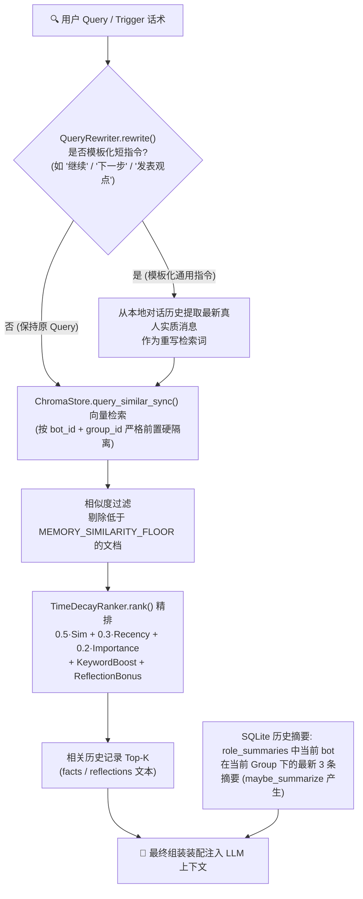
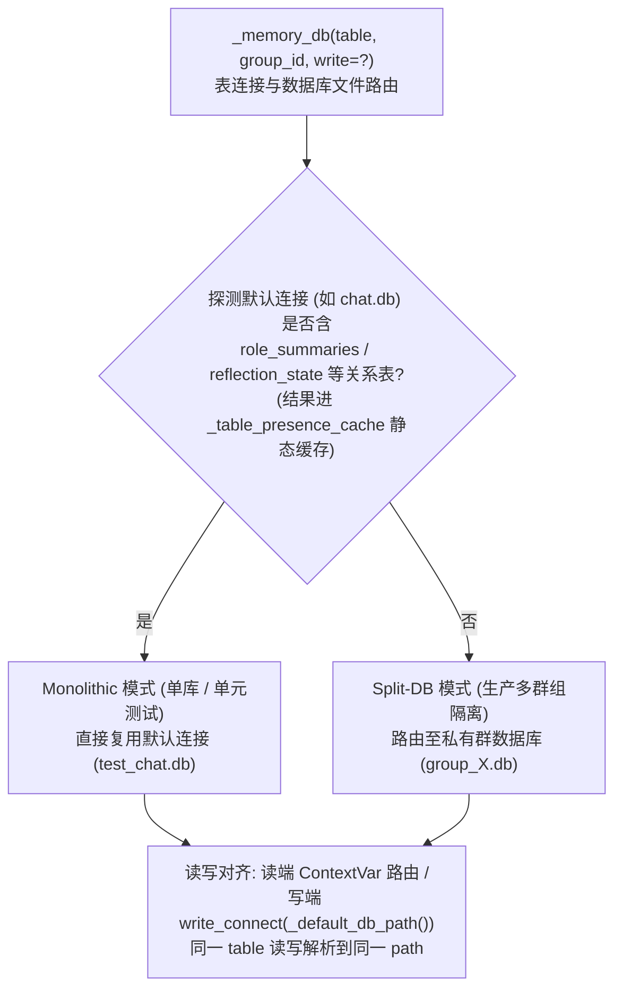

# Agent 记忆与反思系统设计规范 (Agent Memory & Reflection System Design)

本文件详细记录了 `nuke-ai-collaborator` 项目中智能体记忆系统的整体架构设计、关键流程与底层路由实现，供后续开发、审计及维护参考。

---

## 1. 整体架构拓扑 (Architecture Topology)

记忆系统采用**“双轨存储、项目单元物理隔离、具备语义防冲突与物理衰减”**的设计模式，由三条主链路组成：写入提取、周期反思、检索装配，全部跑在 Group 物理隔离之上。

### 1.1 记忆写入与提取流水线 (Memory Ingestion Pipeline)

### 1.2 知识固化与周期反思机制 (Periodic Reflection & Knowledge Compaction)

### 1.3 记忆检索与上下文装配机制 (Retrieval & Context Assembler)

> 精排 `RANK` 的子因子：时间衰减 `recency = exp(-λ·Δt)`（半衰期 7 天）；Alphanumeric Boost（检索词中精确数字/配置英文名词命中，+0.08/次，封顶 +0.2）；Reflection Bonus（`mem_type='reflection'` 在最终打分上额外叠加奖励分）。详见 §2.3。

---

## 2. 核心模块设计与关键实现

### 2.1 事实提取与降噪 ([FactExtractor](file:///Users/Nuke/claudeFolder/nuke-ai-collaborator/backend/ai/memory.py#L191))
* **前置降噪**: 字符长度小于 8 的文本直接静默丢弃（如 “OK”, “是的”, “收到” 等），避开不必要的 LLM 序列化开销。
* **事实提取与 Salience 打分**: 将发言传递给群组实际绑定的 LLM 提供商 (非硬编码)，返回格式化为 `事实内容|Salience Score` 形式的事实。Salience Score 范围是 `[0.0, 1.0]`，代表对后续软件工程决策的重要程度。
* **隐私脱敏**: 提取出来的事实在写入 Chroma 前，自动通过 `redact_secrets` 过滤常见的 PII 与敏感令牌（如 AWS 访问密钥、JWT等），防范隐私泄漏与大模型信息越权。

### 2.2 批量语义消解机制 ([ConflictResolver](file:///Users/Nuke/claudeFolder/nuke-ai-collaborator/backend/ai/memory.py#L237))
* **单次批量查询**: 使用 `ChromaStore.query_many_similar_sync` 代替对单个 collection 串行发出 $N$ 次检索，规避线程安全风险，降低网络与并发吞吐压力。
* **Top-N 候选关联**: 为每一条新事实查询最近的 3 条历史事实，并将余弦距离小于 0.25 的历史项标记为排他性冲突候选。
* **单次 LLM 判定**: 把全部新事实与冲突候选打包成单个 Prompt 发送给零温 LLM 判定，解析 JSON 数组得到待失效的旧记忆 ID。
* **防幻觉安全删除**: 仅删除位于检索候选集中的 ID，预防 LLM 捏造不存在的 ID 引起非预期误删，并通过 `delete_ids_sync` 批量删除。

### 2.3 多因子时间衰减检索排序器 ([TimeDecayRanker](file:///Users/Nuke/claudeFolder/nuke-ai-collaborator/backend/ai/memory.py#L318))
* **相似度过滤门槛 (Similarity Floor)**: 相似度低于 `MEMORY_SIMILARITY_FLOOR` 的文档直接被剔除，防止模型产生检索幻觉。
* **物理时间指数衰减**: 采用绝对时间衰减公式，其半衰期默认为 7 天。
  $$\text{recency} = e^{-\lambda \cdot \Delta t}$$
  其中 $\Delta t$ 是当前时间与记忆产生时间的时间戳差。
* **Alphanumeric 关键字匹配权重增强**:
  为了高精度命中专业配置与代码段，通过正则提取检索词中的英文/数字关键字。若在召回文档中精确出现，则每次额外给融合打分叠加 `0.08` 奖励加权（最高增加 `0.2`）。
* **反思记忆特权 (Reflection Bonus)**:
  在融合分中，若文档元数据 `mem_type` 标记为 `reflection`，说明是沉淀出来的核心高阶洞察，其融合总分自动叠加 `REFLECT_RETRIEVAL_BONUS`，使其相比普通细碎的 Fact 更加容易浮现。
* **混合打分公式**:
  $$\text{Final Score} = 0.5 \times \text{Similarity} + 0.3 \times \text{Recency} + 0.2 \times \text{Importance} + \text{KeywordBoost} + \text{ReflectionBonus}$$

### 2.4 反思与知识固化层 ([maybe_reflect](file:///Users/Nuke/claudeFolder/nuke-ai-collaborator/backend/ai/memory.py#L660))
* **增量触发与水位线**: 每次反思从 `reflection_state` 加载上一次记录的覆盖时间戳 `covered_through_ts`。检索仅针对这以后的增量事实进行，不会反复重读历史信息。
* **积压强制推进 (Watermark Force-Advance)**:
  若系统中积累了大量琐碎的低 salience 事实，导致其数量超过了反思触发的积压阈值 (`REFLECT_MAX_BACKLOG`)，但又始终凑不够总重要性分数的触发门槛，系统会在此时**强制向前推进水位线**以物理抛弃此部分低价值事实，消除长尾内存增长。
* **多层级反思结构 (A-MEM Trace)**:
  支持多级反思（如 Level-1, Level-2），利用溯源引用 `source_ids` 构建知识网络，记录每个反思点是由哪些原子事实或下一级反思聚合提炼出来的。开发者或智能体在检索时，可以通过 `get_memory_links` 实现反思树的跨跳追踪与可视化展开。

---

## 3. 📂 项目单元隔离与多数据库路由设计 (Dynamic Router)

系统要求对不同的 Group 进行完全物理隔离。由于 Chroma 是单一的全局向量库，我们通过内置在文档 Metadata 中的 `group_id` 与 `bot_id` 属性进行硬编码级过滤。

> **Metadata 字段约定**：每条记忆的 metadata 至少包含 `bot_id` / `group_id`（隔离硬过滤）、`role`、`timestamp`（时间衰减）、`importance`（即 salience，三因子加权）、`mem_type`（fact / reflection）、`scored_by_model`（打分模型来源，形如 `provider/model`）。reflection 额外带 `level` 与 `source_ids`（A-MEM 溯源）。其中 `scored_by_model` 用于将来某 Group 切换打分模型时，按 `scored_by_model` 圈出旧刻度记忆做 salience 归一化重标，避免新旧两套刻度混排污染检索/反思闸门——存量记忆经 `scripts.backfill_chroma_scored_by_model` 一次性标为 `legacy/unknown`。

对于 SQLite 中的非结构化大历史，我们实现了如下的动态分库查找与切换机制：

### 3.1 动态探测与缓存路由表
* 通过探测 `sqlite_master` 检查关系数据库表是否存在于当前默认连接中。
* 使用 `_table_presence_cache` 静态缓存探测结果，避免对于高频对话轮次，每个 bot 响应步骤都并发探测 SQLite 文件产生高昂的 I/O 损耗。

### 3.2 读写连接对齐机制
* 读端 `connect` 会利用 ContextVar 和 DB 路由；写端 `write_connect` 必须指定正确的群文件路径。
* 为保证一致性，统一通过辅助方法 `_resolve_memory_db_path` 获取目标路径并对齐，消除由于 monolithic 与 split 模式不对称导致测试修改污染生产数据库文件的漏洞。

---

## 4. 最近重构与优化项记录 (Changelog & Fixes)

在最近一次优化和严厉审查中，我们彻底解决并补齐了以下缺陷：
1. **Chroma ID 位置对齐漏洞修复**:
   修改了 [add_to_chroma](file:///Users/Nuke/claudeFolder/nuke-ai-collaborator/backend/ai/memory.py#L433) 中的失效删除映射。之前按循环索引删除导致超出 facts 数量的冲突 ID 无法删除；修改为全量 `delete_ids_sync` 批量删除。
2. **群组删除数据孤儿修复**:
   将 `role_summaries` 清理规则从中央 DB 静态定义移动到私有 Group 数据的 `_MEMBER_DATA` 表删除事务中，防止分裂模式下删除群成员导致角色摘要在 group.db 中残留。
3. **单元测试隔离性回灌防护**:
   修正了 `maybe_summarize` 的外部直接调用测试。通过 `_table_exists_in_default_db` 在探测不到表时回落群组数据库前，做好了默认 test_chat.db 拦截，彻底消除了单元测试对本地磁盘存在的 `group_1.db` 的污染。
4. **反思水位线防爆卡兜底**:
   引入了 `REFLECT_MAX_BACKLOG` 水位强制截断逻辑，解决了低质量日志积压引起的水位线停滞不前问题。
5. **打分模型来源溯源 (scored_by_model)**:
   `add_to_chroma` / `maybe_reflect` 写入时记录 `scored_by_model`（`provider/model`），使将来某 Group 切换打分模型时可按来源对旧刻度 salience 做归一化重标；存量记忆经 `scripts.backfill_chroma_scored_by_model` 一次性标为 `legacy/unknown`。
