# 推测性预执行 (Speculative Execution) 架构设计

在 `nuke-ai-collaborator` 多智能体协作平台中，高延迟的工具双向环（Tool Loops）以及频繁的人类确认门禁（Confirm Gates）是主要的等待耗时来源。

为了在**保持人类绝对控制权和流程透明性**的前提下，将协作等待时间降低到毫秒级，本设计引入**基于草稿态隔离（Draft-based）的推测性预执行方案**。

---

## 1. 核心业务流程

当上游智能体完成本阶段工作并抛出确认门禁（Confirm Gate）时，系统在后台对下一阶段的智能体进行**推测性预先调度**。

- **预执行产出在确认前对用户完全不可见**，处于“草稿”状态。
- **确认推进（Commit）**：将预执行产生的“草稿”内容合并到正式聊天历史中，秒级滑出结果。
- **打回/返工（Discard）**：物理删除“草稿”内容，彻底废弃。

```mermaid
sequenceDiagram
    participant User as 人类用户
    participant Dev as Dev Bot
    participant QA as QA Bot (预执行)
    participant DB as 数据库 (SQLite)

    Dev->>DB: 1. 输出“开发完毕” (触发 Confirm Gate)
    Note over User, Dev: 流程挂起，等待人类决策
    
    rect rgb(20, 20, 40)
        Note right of QA: 系统静默启动 QA 推测预执行
        QA->>DB: 2. 写入测试报告 (标记为 is_draft = 1)
    end
    
    User->>User: 3. 阅读 Dev 产出的代码和说明
    
    alt 人类点击 [确认]
        User->>DB: 4. 触发 /workflow/confirm API
        DB->>DB: 5. 提交草稿: is_draft = 0
        DB->>User: 6. 正式广播测试报告 (零延迟呈现)
    else 人类点击 [打回]
        User->>DB: 4. 触发 /workflow/rework API
        DB->>DB: 5. 清理草稿: DELETE WHERE is_draft = 1
        DB->>User: 6. 流程回退，不留痕迹
    end
```



---

## 2. 详细技术实现方案

### 2.1 数据库结构变更 (Database Schema)

在群聊私有库的 `messages` 表中新增 `is_draft` 字段，以实现对推测产出的逻辑隔离。

```sql
-- 针对新消息表的默认字段
ALTER TABLE messages ADD COLUMN is_draft INTEGER DEFAULT 0;

-- 创建索引以优化日常历史查询
CREATE INDEX IF NOT EXISTS idx_messages_draft ON messages(group_id, is_draft, id);
```

> [!IMPORTANT]
> **API & WebSocket 隔离规则**：
> - 所有的消息查询接口（如 `get_messages`、`get_all_messages`）必须在 SQL 过滤中加入 `WHERE is_draft = 0`。
> - WebSocket 广播在向客户端推送 `stream_start`、`stream_chunk` 和 `message` 事件时，如果该流属于预执行阶段，必须阻止向前端客户端发送，或打上特定 `draft` 标记进行屏蔽。

### 2.2 工作区沙箱隔离 (Workspace Sandbox Isolation)

由于预执行在用户确认前运行，因此必须防止其直接在当前工作区修改代码，引发副作用。

* **只读操作优先**：预执行（如 QA 测试）通常只需要读取代码。
* **分支隔离（Branch Isolation）**：如果预执行工具确需修改文件，系统必须在 `workspaces/` 下自动建立一个微型的临时 Worktree 分支（如 `spec-temp-{group_id}`）。
* **清理机制**：一旦流程发生 Commit 或 Discard，由系统调度器异步强制回收该临时工作区。

### 2.3 状态流转与双向提交 (Commit / Discard)

在 `backend/core/workflow.py` and `backend/core/runner.py` 中引入两阶段提交逻辑：

#### 触发预执行
当 `apply_step` 检测到工作流处于挂起卡片状态（`step.confirm_gate` 非空）时，调用下一步智能体的 `pre_execute` 方法：
```python
if step.confirm_gate:
    # 异步默默拉起下一步的预执行，传入 is_draft=True
    bg.spawn(run_speculative_unit(group_id, next_unit))
```

#### 两阶段控制
```python
async def commit_speculative_data(group_id: int) -> None:
    """确认通过：将草稿消息正式生效并向前端广播"""
    async with write_connect(group_db_path(group_id)) as db:
        # 1. 选出草稿态消息
        cur = await db.execute("SELECT * FROM messages WHERE group_id = ? AND is_draft = 1", (group_id,))
        drafts = await cur.fetchall()
        
        # 2. 将状态翻转为正式消息
        await db.execute("UPDATE messages SET is_draft = 0 WHERE group_id = ? AND is_draft = 1", (group_id,))
        await db.commit()
    
    # 3. 广播广播消息，前端收到后追加到消息列表，用户体验为秒出
    for msg in drafts:
        await bus.broadcast(group_id, {"type": "message", **msg})

async def discard_speculative_data(group_id: int) -> None:
    """打回重做：物理删除草稿，并清理沙箱"""
    async with write_connect(group_db_path(group_id)) as db:
        await db.execute("DELETE FROM messages WHERE group_id = ? AND is_draft = 1", (group_id,))
        await db.commit()
    # 异步清理临时分支/目录
    bg.spawn(cleanup_speculative_workspace(group_id))
```

---

## 3. 前端交互设计

由于草稿消息在确认前被过滤，用户界面在确认前不会有任何变化，完美保证了透明性。

当用户点击 **[ 确认 ]** 时：
1. 前端向后端发送 `/api/groups/{group_id}/workflow/confirm` 请求。
2. 后端瞬间将 `is_draft` 翻转为 `0`，并通过 WebSocket 广播。
3. 前端接收到正式的 QA 消息包，聊天面板平滑滚动并依次渲染出测试结论。原本漫长的机器思考时间在用户侧变成了**瞬间滑出结果**。

---

## 4. 异常边界处理 (Edge Cases)

* **预执行仍在跑时用户点击了 [确认]**：  
  如果 QA 跑 pytest 还没结束（预执行仍在进行中），用户便点击了确认。系统将自动“接轨转正”：将该任务的执行模式由 `draft` 切换为 `live`，后续产生的 Stream 字符直接广播给前端呈现。
* **LLM 限流 (Rate Limit) 保护**：  
  由于预执行是一项提速机制，一旦遇到平台 API 限制（如 429 Error），系统应主动放弃预执行（Graceful Degradation），改为传统的确认后再启动模式，绝不影响主流程的健壮性。
