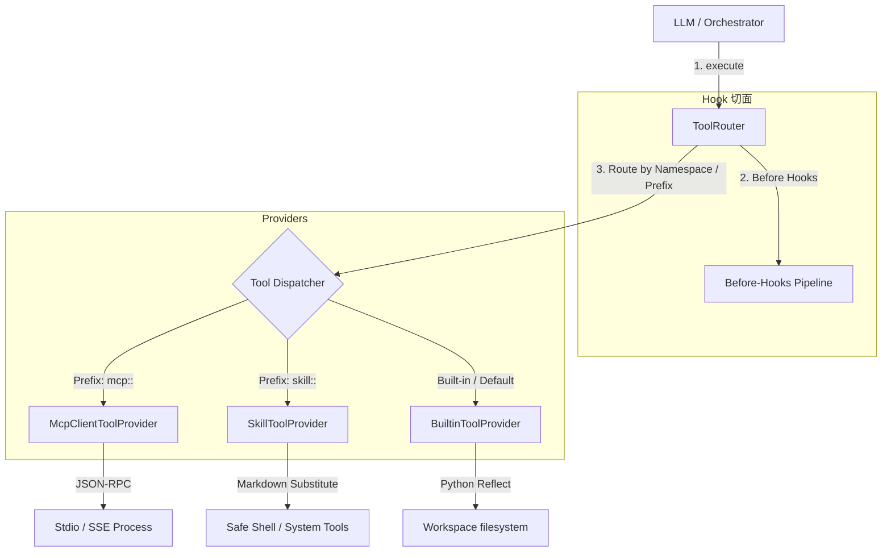

# Tool Executor 架构重构设计方案 (分层路由器与 Provider 模式)

> 最后更新：2026-06-07
> 状态：设计选型中

为解决当前项目中 `tool_executor.py` 全局扁平化耦合的问题，本方案设计了一套层次分明、高度解耦、面向接口的工具执行器路由系统。

---

## 一、 业界主流智能体框架的工具分层设计对比

| 框架 | 架构模式 | 路由分流机制 | 优点 |
| :--- | :--- | :--- | :--- |
| **Claude Code** | **对象级 Registry 模式** | 注册统一继承 `Tool` 基类的实例。区分 `LocalTool`、`AgentTool`、`MCPTool`，由对应的具体类负责执行。 | 面向对象程度高，各工具自治能力强。 |
| **opencode** | **Effect-TS 服务池模式** | 将 Tool 封装为服务（Service）。执行阶段通过 Effect 的依赖注入，按需调度 `McpService` 或本地 `TerminalService`。 | 异步管道并行性能极佳，强类型保障。 |
| **openclaw** | **ToolProvider 提供者模式** | 通过 `ToolRef` 携带的 `kind` 属性（如 `kind: "mcp"` 或 `kind: "local"`)，在网关分发阶段分流到不同处理器。 | 协议层与执行层彻底解耦，扩展极其简便。 |
| **当前项目 (nuke)** | **模块全局扁平 dict 注册** | 所有的 Python 函数插件都通过 `tool_executor.register()` 扁平化注册进全局的私有 `_handlers` 字典中。 | 简单直观，但极易造成命名空间污染、锁竞态控制混乱。 |

---

## 二、 当前架构痛点分析

1. **上帝对象 (God Module)**：
   [tool_executor.py](file:///Users/Nuke/claudeFolder/nuke-ai-collaborator/backend/executors/tool_executor.py) 不仅要处理工具的注册、别名转换，还要负责 hook 的切面处理、错误翻译、甚至安全截断提示。
2. **缺乏类型层次 (Lack of Types/Hierarchy)**：
   系统级的 `read_file`、声明式的 markdown `skills`，以及未来网络通信的 `mcp` 工具，在运行时全部退化为 Python 的 `Callable`，失去了各自的生命周期语义。
3. **安全审计与拦截策略耦合**：
   Shell 拦截、越界检查等 Hook 是以扁平的回调形式绑定的，难以根据工具类型（如：只对写操作工具加锁，只对网络工具做证书校对）实现分层过滤。

---

## 三、 重构核心设计：Provider 模式与命名空间路由器

我们引入 **`ToolProvider` (工具源提供者)** 接口和 **`ToolRouter` (工具中央路由器)** 概念：



### 1. 工具提供者接口

```python
from abc import ABC, abstractmethod
from executors.base import ToolDef

class ToolProvider(ABC):
    @property
    @abstractmethod
    def provider_id(self) -> str:
        pass

    @abstractmethod
    async def discover_tools(self) -> list[ToolDef]:
        """扫描并发现此 Provider 支持的工具列表。"""
        pass

    @abstractmethod
    def can_handle(self, name: str) -> bool:
        """判定该工具是否由本 Provider 执行。"""
        pass

    @abstractmethod
    async def execute(self, name: str, arguments: dict, context: dict) -> tuple[str, bool]:
        """具体的执行逻辑，由各 Provider 子类自行实现。"""
        pass
```

### 2. 三大具体提供者实现 (Concrete Providers)

*   **`BuiltinToolProvider`**：
    *   **职责**：处理本地物理文件读写（如 `read_file`、`write_file`）、代码搜索等高权且底层的原生工具。
    *   **实现**：保留当前 Python 函数导入的模式，管理底层操作系统 I/O。
*   **`SkillToolProvider`**：
    *   **职责**：专门负责声明式 markdown 技能的加载与求值。
    *   **实现**：解析 `${SKILL_DIR}`、执行文本参数替换、调用内置的参数替换管道（[processor.py](file:///Users/Nuke/claudeFolder/nuke-ai-collaborator/backend/skills/processor.py)）。
*   **`McpClientToolProvider`**：
    *   **职责**：处理所有的远程及本地进程间通信 MCP 工具。
    *   **实现**：管理 stdio 子进程生命周期，处理 JSON-RPC 消息转换与通信通道状态。

### 3. 工具中央路由器

```python
import logging
from typing import List

logger = logging.getLogger(__name__)

class ToolRouter:
    def __init__(self):
        self._providers: List[ToolProvider] = []
        self._before_hooks = []
        self._after_hooks = []

    def register_provider(self, provider: ToolProvider):
        self._providers.append(provider)
        logger.info(f"Registered ToolProvider: {provider.provider_id}")

    async def get_all_schemas(self) -> list[dict]:
        """搜集所有 Providers 提供的工具定义。"""
        schemas = []
        for p in self._providers:
            defs = await p.discover_tools()
            for d in defs:
                schemas.append({
                    "type": "function",
                    "function": {
                        "name": d.name,
                        "description": d.description,
                        "parameters": d.parameters,
                    }
                })
        return schemas

    async def execute(self, name: str, arguments: dict, context: dict) -> tuple[str, bool]:
        # 1. 统一执行 Before Hooks (切面拦截，安全审计)
        for hook in self._before_hooks:
            verdict = await hook(name, arguments, context)
            if verdict and verdict.get("block"):
                return f"[已拦截] {verdict.get('reason')}", True

        # 2. 路由分发给具体的 Provider
        target_provider = None
        for p in self._providers:
            if p.can_handle(name):
                target_provider = p
                break

        if not target_provider:
            return f"[错误] 未找到能处理工具 '{name}' 的提供者", True

        # 3. 具体的 Provider 内部独立执行参数别名归一、加锁、物理调用等
        result, is_error = await target_provider.execute(name, arguments, context)

        # 4. 统一执行 After Hooks
        for hook in self._after_hooks:
            transformed = await hook(name, arguments, result, context)
            if transformed is not None:
                result = transformed

        return result, is_error
```

---

## 四、 重构带来的核心设计收益

1. **100% 消除扁平冲突**：
   不同的工具类型有各自的命名域，路由器根据前缀和特征分流，即使存在同名的本地工具与远程工具也互不干扰。
2. **生命周期自治**：
   MCP 服务端的重启、子进程硬杀回收，仅由 `McpClientToolProvider` 的实例在内部管理，主程序的 `tool_executor` 不再需要知道管道和子进程的存在。
3. **测试可插拔 (Testability)**：
   在编写单元测试时，我们不需要 mock 全局的模块状态，只需向 `ToolRouter` 注册一个 Mock 类型的 `ToolProvider` 实例即可，测试稳定性大幅增强。
