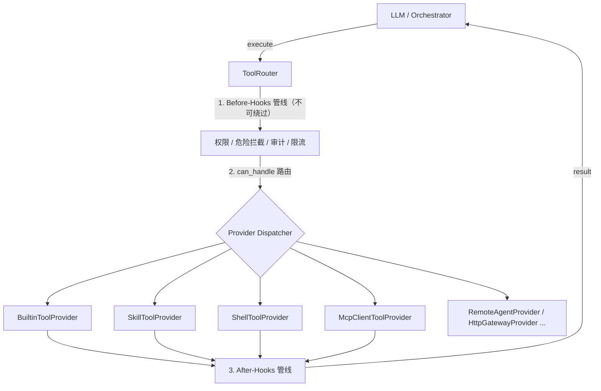

# 工具执行层战略方案：统一 Provider 路由（Plan B）

> 最后更新：2026-06-07
> 状态：战略目标架构（North Star）／暂不实施
> 关联文档：[TOOL-EXECUTOR-REFACTOR-DESIGN.md](file:///Users/Nuke/claudeFolder/nuke-ai-collaborator/docs/TOOL-EXECUTOR-REFACTOR-DESIGN.md)、[MCP-SYSTEM-COMPARISON.md](file:///Users/Nuke/claudeFolder/nuke-ai-collaborator/docs/MCP-SYSTEM-COMPARISON.md)、[SKILL-ARCHITECTURE.md](file:///Users/Nuke/claudeFolder/nuke-ai-collaborator/docs/SKILL-ARCHITECTURE.md)

本文档记录工具执行层（tool execution layer）的**目标架构决策**：在合适的时机演进到"统一 `ToolProvider` + `ToolRouter` 单分发管线"（下称 **Plan B**），以及在此之前为什么保持当前的双车道实现（**Plan A**）。本文是战略选型与迁移判据的依据，不是立即施工单。

---

## 一、背景：当前的实现（Plan A，已落地）

经过一轮安全回归修复后，工具执行层目前是**两条执行车道**：

1. **本地工具车道（registry + hook）**
   builtin / `run_shell` / `run_skill` 全部注册在 `tool_executor._registry`，经
   [tool_executor.execute()](file:///Users/Nuke/claudeFolder/nuke-ai-collaborator/backend/executors/tool_executor.py) 执行，
   全局 before/after hook（权限校验 `_permission_check_hook`、危险命令拦截 `_default_shell_guard`、
   输出截断）在这一层统一切入。

2. **外部 provider 车道（router）**
   MCP 工具**不在** registry 里，由
   [ToolRouter](file:///Users/Nuke/claudeFolder/nuke-ai-collaborator/backend/executors/tool_router.py) 路由到
   [McpClientToolProvider](file:///Users/Nuke/claudeFolder/nuke-ai-collaborator/backend/executors/providers/mcp_client.py)，
   provider 自带 HIL 门禁 + 超时 + allow_list。

分流由 [tool_loop_v1._dispatch_tool](file:///Users/Nuke/claudeFolder/nuke-ai-collaborator/backend/executors/plugins/tool_loop_v1.py) 按"是否在 registry 里"决定：

```
_dispatch_tool(name):
    if not tool_executor.has_tool(name) and router.has_providers():
        return router.execute(name, ...)      # 外部（MCP）
    return tool_executor.execute(name, ...)    # 本地（过 hook）
```

> Plan A 的本质：**用"注册归属"区分"受 hook 治理的本地工具"与"自带门禁的外部 provider"。** 它匹配当前真实基数——外部 provider 只有 MCP 一种。

---

## 二、Plan B：目标架构（统一 Provider 路由）

将**所有**工具来源统一为 `ToolProvider`（builtin / skill / shell / mcp / 未来的 remote-agent-as-tool / HTTP 工具网关 …），全部经 `ToolRouter` 单一管线分发；横切策略（权限、审计、限流、可观测、危险拦截）提升到 router 层，对每个 provider 一视同仁地切入。



`docs/TOOL-EXECUTOR-REFACTOR-DESIGN.md` 已给出 `ToolProvider` 接口与 router 的目标伪代码（含 router 持有 `_before_hooks` / `_after_hooks` 并在 `execute()` 内统一切入）。Plan B 即把那份设计**完整、正确地**落地。

---

## 三、为什么 Plan B 更"符合架构原则"

| 原则 | Plan B（统一 router） | Plan A（双车道） |
| :--- | :--- | :--- |
| 统一抽象 / SRP | ✅ 单一 `ToolProvider` 接口、单分发路径 | ➖ 两条道，`_dispatch_tool` 带分支 |
| 开闭（OCP） | ✅ 加工具类型＝加 provider，不改分发逻辑 | ➖ 新增外部类需触碰分流判断 |
| 横切关注点单点化 | ✅ 权限/审计/限流/观测集中在 router 一层 | ➖ hook 在 tool_executor，MCP 门禁在 provider，两处 |
| 测试可插拔 | ✅ 注册 Mock provider 即可，无需 mock 全局模块状态 | ➖ 仍需操作 `tool_executor` 全局状态 |
| 命名空间隔离 | ✅ 前缀/特征路由，本地与远程同名工具互不干扰 | ➖ 依赖 registry 唯一性 |

**单看原则，Plan B 完胜。但"符合原则"不等于"此刻更优"——见下。**

---

## 四、为什么现在不迁（Plan A 此刻更对）

1. **统一接口并未消除差异，只是搬运。**
   危险拦截是 shell 专属；权限有逐工具语义（`_APPROVAL_REQUIRED_TOOLS` / `_AUTO_ALLOW_TOOLS` / `spawn_depth`）；MCP 要求"结果当不可信外部数据 + 写操作 HIL + 超时"。塞进"一层 hook"会让 hook 体充满 `if name == / if provider ==` 开关。这是**本质复杂度**，迁移不会消灭它。

2. **外部 provider 当前只有 MCP 一种。**
   为单一外部情况建"万物皆 provider"的统一管线属 speculative generality；YAGNI 站 Plan A。

3. **最关键的历史教训——错误的 Plan B 形态恰恰制造了一次安全回归。**
   早期 scaffolding 让 `run_shell` 降格成 `ShellToolProvider` 并实现独立 `execute()`，而全局 hook 仍留在 `tool_executor`。结果 `run_shell` 经 router 首匹配直达 provider，**悄悄绕过了权限校验与危险命令拦截**——无 ruleset 时本应 fail-closed 的命令变成无条件执行。

   > 这是过早抽象的经典翻车：把两个**不变量不同**的东西（本地工具必须过 hook ／ 外部 provider 走自带门禁）压进同一接口，而接口没有把"必须过 hook"编码进去，于是任何 provider 都能 opt-out。**类型系统没替你守住这个不变量。**

   该回归已修复（见 commit `d5ab65e`，分支 `fix/tool-router-dispatch-and-schema-leak`），修法即回归到 Plan A 双车道，并补了守门测试 `test_run_shell_still_gated_by_before_hooks`。

---

## 五、迁移判据（什么时候才真正上 Plan B）

当且仅当出现**统一治理面（unified governance plane）的刚性需求**时迁移，典型触发信号：

- 外部工具来源从 1 种（MCP）增长到多种：**remote-agent-as-tool**（多 agent 互为工具）、HTTP 工具网关、沙箱代码执行器等；
- 需要对**所有**工具来源（含本地工具）施加**统一**的权限 / 审计日志 / 限流 / 配额 / 可观测（trace）策略；
- `_dispatch_tool` 的分支与各 provider 内部重复的门禁逻辑开始显著漂移、难以保持一致。

在那之前，Plan B 的"干净"是负债而非资产（那次安全洞就是利息）。**原则服务于目标，不能反过来。**

---

## 六、Plan B 实施的不可协商约束

若启动迁移，以下为**硬约束**，违反即重蹈安全回归：

1. **Hook 进 router 本体。**
   `_permission_check_hook`、`_default_shell_guard`、输出截断等横切策略由 `ToolRouter.execute()` 在调用 `provider.execute()` **之前/之后**统一切入，而**不是**放进任一 provider 的委托路径。

2. **`ToolProvider.execute()` 只能由 router 调用。**
   通过约定 + 测试守护（必要时用命名/可见性约束），确保没有任何调用方能绕过 router 直接执行 provider，从而绕过 hook 管线。

3. **横切策略不可绕过（non-bypassable by construction）。**
   `BuiltinToolProvider` 委托回 `tool_executor` 的纯执行路径时，必须传 `run_before=False`（或等价机制）以避免 hook 双跑；其余 provider 的门禁要么并入 router 管线，要么作为 provider 内的二级 backstop——但 router 层的一级闸不得缺位。

4. **保留逐工具差异化能力。**
   router 的 hook 管线需支持按 `provider_id` / 工具名 / 工具类别施加不同策略（写操作加 HIL、网络工具做证书校验、外部结果标记为不可信），不能退化成"一刀切"。

5. **守门测试先行。**
   迁移前补齐"每类工具经 router 后其应有的门禁仍触发"的断言（现有 `test_run_shell_still_gated_by_before_hooks` 是模板），让任何重新打开绕过路径的改动立即变红。

---

## 七、分阶段迁移路径（建议）

1. **阶段 0（现状）**：Plan A 双车道。外部仅 MCP，走 router；本地走 tool_executor + hook。
2. **阶段 1**：将 hook 管线提升进 `ToolRouter`（`_before_hooks` / `_after_hooks`），`tool_executor.execute()` 增加 `run_before` 开关；`BuiltinToolProvider` 委托时关闭重复 hook。此阶段对外行为不变，仅把"治理面"挪到 router——为后续统一打底。
3. **阶段 2**：当第二种外部 provider（如 remote-agent-as-tool）出现时，将其接入 router，并把其门禁纳入 router 一级管线。
4. **阶段 3**：逐步把 shell / skill 也变为经 router 分发的 provider（复用 router hook，删除 `_dispatch_tool` 的 registry 分支）。完成后 `_dispatch_tool` 收敛为"一律 router.execute"。
5. **阶段 4**：`tool_executor` 退化为 `BuiltinToolProvider` 的纯执行引擎（registry + 反射调用 + 别名归一），不再承载横切策略。

每个阶段都应保持"全绿 + 守门测试覆盖"，可独立合入、可回退。

---

## 八、与现存 Provider 残件的关系

当前 [executors/providers/shell.py](file:///Users/Nuke/claudeFolder/nuke-ai-collaborator/backend/executors/providers/shell.py)、
[skill.py](file:///Users/Nuke/claudeFolder/nuke-ai-collaborator/backend/executors/providers/skill.py)
是早期 Plan B scaffolding 的残件：**已不再注册（见 [runtime/entry.py](file:///Users/Nuke/claudeFolder/nuke-ai-collaborator/backend/runtime/entry.py)，worker 只注册 MCP provider + Builtin catch-all）、不在任何执行链路上**，其 `execute()` 仍是直接调 handler、**绕过全局 hook** 的旧形态。

- 它们**不**服务于任何现有场景（包括"skill 携带脚本文件"的经典用法——该用法由 `run_skill` 返回脚本路径、agent 再发受保护的 `run_shell` 执行，全程不碰这两个 provider）。
- 保留它们作为 Plan B 阶段 3 的起点是可以的，但接入前**必须**先完成阶段 1（hook 进 router），否则直接注册会重新引入安全回归。

#### ✅ 已修复（曾经的活雷）：文件 docstring 曾写着与事实相反的"安全保证"

> 状态：已于 docstring 修复后对齐。下文保留问题描述作为**为什么不能注册**的依据；`shell.py` / `skill.py` 顶部现已是 `DO NOT REGISTER` 警告（不再是下面引用的失实保证）。

源码核对曾发现，这两个文件顶部的 docstring **不只是"旧形态"，而是在主动声称一个不存在的安全保证**，与本文档 §四.3 / §六的不变量当面矛盾。`shell.py` 当时的 docstring 原文：

> "The global `_permission_check_hook` in tool_executor still fires first (via BuiltinToolProvider's delegation path) for permission/ruleset gating — `ShellToolProvider.execute()` is only reached after hooks pass."

这句话是**错的**，且错得危险：

1. 这两个 provider 根本没注册、不在任何路径上，"only reached after hooks pass" 描述的是一条**不存在的路径**；
2. 更糟——`ToolRouter` 是 **first-match** 路由。一旦有人按 docstring 的暗示把 `ShellToolProvider` 注册进 router，`run_shell` 会**首匹配直达** `ShellToolProvider.execute()`，**跳过** `BuiltinToolProvider` 的委托路径，于是 `_permission_check_hook` / `_default_shell_guard` **根本不会触发**——正是 §四.3 修复过的那次安全回归。

最坏链条：**未来开发者读到这段"hook 一定先跑"的 docstring → 信以为真 → 注册 provider → 静默重引入安全洞。** 这正是"不变量只活在战略文档、没编码进开发者会读的代码注释里"的复发隐患。

**修复（已完成）**：已把这两个文件顶部那段"hooks fire first / only reached after hooks pass"的失实 docstring 删除，替换为 `DO NOT REGISTER` 警告——

> `DO NOT REGISTER`：本 provider 的 `execute()` 直接调 handler，**绕过全局 before/after hook**（权限校验 + 危险命令拦截）。`ToolRouter` 为 first-match，注册即让 `run_shell`/`run_skill` 绕过安全闸（参见本文档 §四.3 的安全回归）。接入前必须先完成本文档阶段 1（hook 进 router 本体）。

> 注：失实 docstring 发现于 commit `3785ec3` 时点，现已替换为上述警告（`shell.py` / `skill.py` 模块级 + class 级 docstring 均已更新）。本节与源码现已对齐。

---

## 九、一句话结论

**Plan B 是更好的终局架构，前提有二：(1) 你确实需要跨所有工具源的统一治理面；(2) 把 hook 做成 router 层不可绕过的管线。在这两个前提同时成立之前，Plan A 才是更对的工程决策。**
