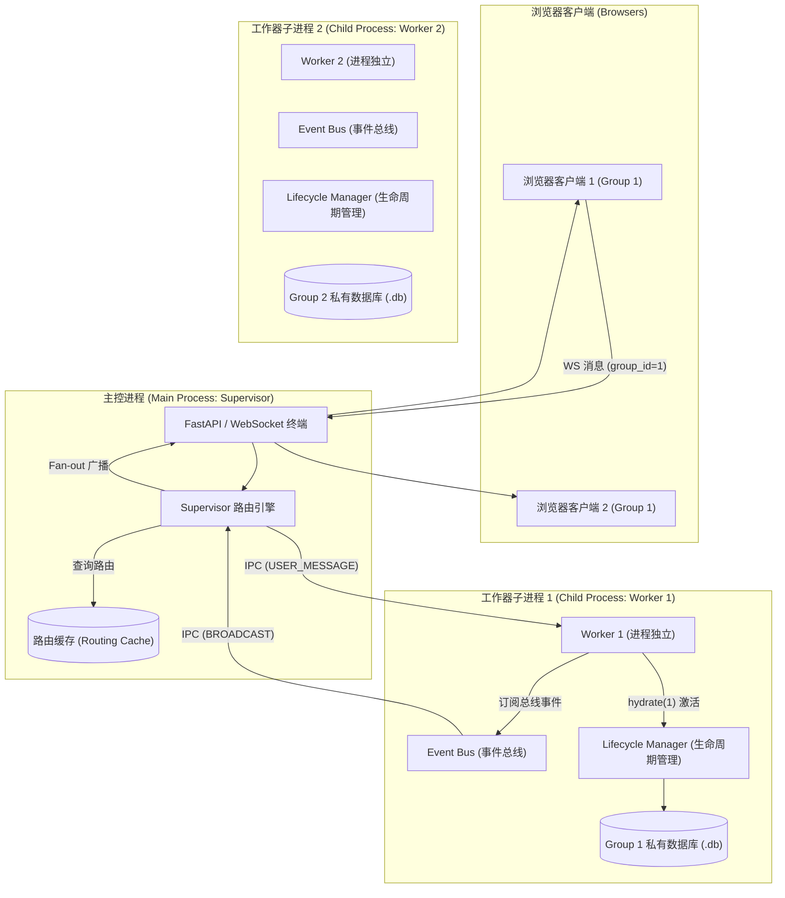
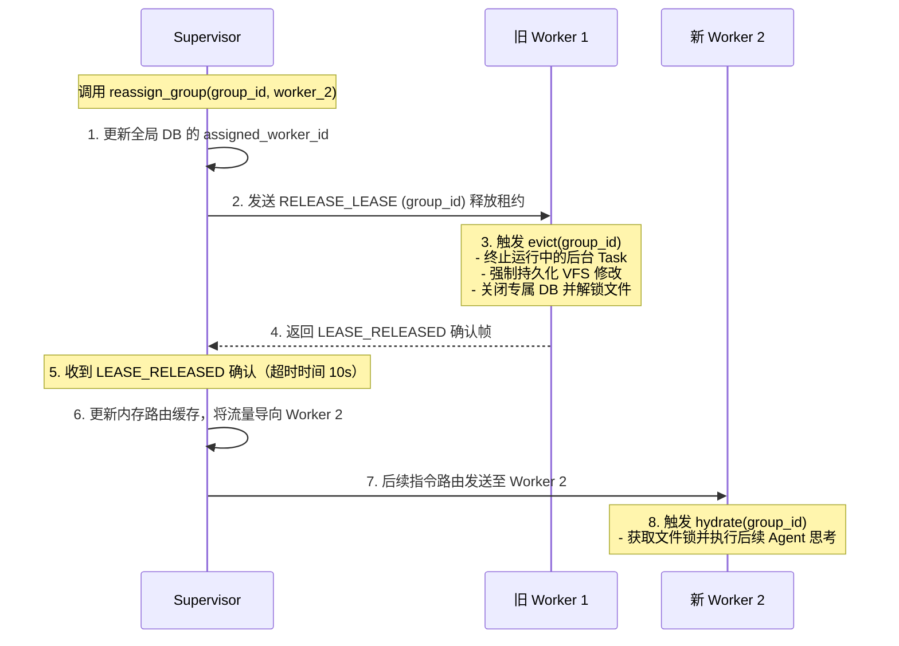

# Supervisor, Worker 与 Group 架构关系分析

本报告详细剖析了系统在项目单元隔离（Project-Cell Isolation V3）设计下，**Supervisor（主控进程）**、**Worker（工作器子进程）** 与 **Group（会话单元/组）** 三者之间的核心逻辑、通信路径和生命周期协作关系。

---

## 1. 架构拓扑与进程模型

系统采用**多进程分片（Multi-Process Sharding）**架构，将 WebSocket 的接入终端与 AI Agent 的复杂计算隔离在不同的 OS 进程中，以防范 Event Loop 阻塞及提高多核 CPU 利用率。

---

## 2. 核心组件角色定义

### 1) Supervisor (主控/路由进程)
* **唯一入口**：负责对外暴露 Web API，接受所有浏览器客户端的 WebSocket 连接（[App.jsx](file:///Users/Nuke/claudeFolder/nuke-ai-collaborator/frontend/src/App.jsx) -> `main` 进程接入点）。
* **Worker 生命周期管理**：启动时根据配置调用 `_spawn_workers(k)` 自动拉起 `k` 个 Worker 子进程，在退出时负责回收并杀掉它们（[supervisor.py:L54-80](file:///Users/Nuke/claudeFolder/nuke-ai-collaborator/backend/runtime/supervisor.py#L54-L80)）。
* **中心路由 (Fan-out & Routing)**：维护 `group_id -> worker_id` 的绑定关系。负责将外部下发的消息路由给对应的 Worker，并将 Worker 上报的消息广播（Fan-out）给注册在该 Group 下的所有浏览器客户端。
* **唯一状态写入者**：集中聚合各个 Worker 发来的 `UNREAD_DELTA` 数据，维护未读消息数的中心投影。

### 2) Worker (计算/执行进程)
* **计算分片**：一个独立的 OS 进程。每个 Worker 启动后通过 IPC 连接到 Supervisor 并发送 `HELLO` 报文注册自己（[worker.py:L47-50](file:///Users/Nuke/claudeFolder/nuke-ai-collaborator/backend/runtime/worker.py#L47-L50)）。
* **私有 DB 绑定**：每个 Worker 独占自己分片内 Group 的数据库句柄，执行命令时动态将上下文绑定到该组的专属 SQLite 分片（如 `db/group_1.db`），保障数据库层面的沙箱隔离（[worker.py:L133-137](file:///Users/Nuke/claudeFolder/nuke-ai-collaborator/backend/runtime/worker.py#L133-L137)）。
* **事件向上流转**：通过在本地订阅通配符事件总线 `self.bus.subscribe_all()`，捕获所有 AI 执行时产生的总线事件，并将其打上 `BROADCAST` 封套，通过 IPC 隧道推送给 Supervisor。

### 3) Group (隔离单元/租约对象)
* **会话单元**：对应前端的一个聊天群组或一个开发会话上下文。
* **租约机制**：在物理上被抽象为独立的目录和数据库锁文件（`group.lock`）。它属于**被托管的临时状态**，由 Worker 的 `LifecycleManager` 进行激活（Hydration）和驱逐（Eviction）管理。

---

## 3. 两大消息流动路径

### 路径 A：下行指令路径 (Browser -> Supervisor -> Worker)
1. 浏览器向 Supervisor 建立 WebSocket 连接并发送群组消息。
2. Supervisor 拦截消息，执行路由查询 `_route(group_id)`（先查 memory cache，未命中则查全局 DB）。
3. Supervisor 通过与该 Worker 建立的 IPC `StreamWriter` 连接发送 `USER_MESSAGE` 指令（[supervisor.py:L194-200](file:///Users/Nuke/claudeFolder/nuke-ai-collaborator/backend/runtime/supervisor.py#L194-L200)）。
4. Worker 收到指令，触发 `LifecycleManager.hydrate(group_id)`：
   * **加锁防多开**：获取物理锁 `group.lock`，防止其他 Worker 抢占导致脑裂。
   * **数据库初始化/迁移**：动态创建并迁移该群组专属的 SQLite DB。
   * **激活 Session & Workflow**：拉起该组挂起的异步任务。
5. Worker 绑定该 DB 句柄，最终调用 `_dispatch` 分发给特定的 AI 机器人执行（[worker.py:L127-137](file:///Users/Nuke/claudeFolder/nuke-ai-collaborator/backend/runtime/worker.py#L127-L137)）。

### 路径 B：上行广播路径 (Worker -> Supervisor -> Browser)
1. AI 机器人在 Worker 进程中运行时，输出中间步骤（如工具调用结果、思考文本等），写入本地总线 `bus`。
2. Worker 进程里的 `_pump_upstream()` 循环捕获到该事件。
3. Worker 将事件序列化成 `BROADCAST` 帧，通过 IPC 连接推给 Supervisor。
4. Supervisor 的 `_on_upstream()` 拦截该帧，调用 `_fanout(group_id, payload)`。
5. Supervisor 遍历并并行推送给当前所有连接在该 `group_id` 上的浏览器 WebSocket 客户端。

> [!TIP]
> **头部阻塞防御（Head-of-Line Blocking Protection）**
> 在 Supervisor 广播时，如果某个浏览器客户端的网络卡顿或 WebSocket 假死，`client.send` 可能会无限期挂起。Supervisor 引入了 `SUPERVISOR_SEND_TIMEOUT`（默认 5s）超时机制（[supervisor.py:L174-191](file:///Users/Nuke/claudeFolder/nuke-ai-collaborator/backend/runtime/supervisor.py#L174-L191)）。超时客户端会被立刻从 `_browsers` 中剔除并强制关闭，保障其他健康的浏览器连接不会被某一个假死连接拖慢。

---

## 4. 接管与迁移协议（Handoff Protocol）

当需要对系统进行负载均衡，或者某个 Group 需要重新指派给另一个 Worker 执行时，系统设计了优雅的**租约转移协议**以避免数据冲突：

此设计通过 **`RELEASE_LEASE`**（释放租约）和 **`LEASE_RELEASED`**（已释放）的握手信号，在秒级时间内完成 Group 所有权的平滑交接，极大地保证了系统的扩展性与状态一致性。
