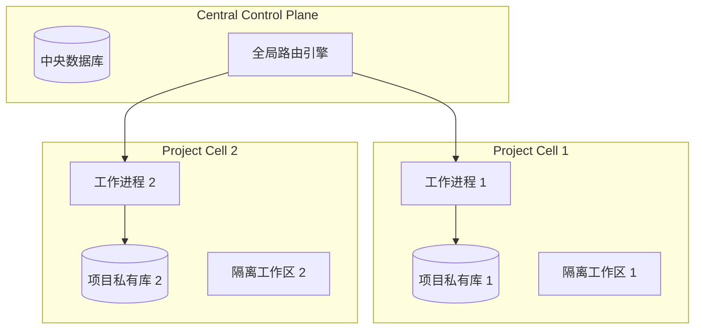

# Nuke AI Collaborator 商业与架构演示文稿 (PPT 结构与演讲词)

本大纲旨在面向客户、管理层或投资者进行汇报演示，用词高度商业化、专业化，突出解决行业痛点与独特的架构壁垒。

---

````carousel
### Slide 1: 封面 (Title Slide)

**重塑人机协作：面向未来软件工程的企业级 AI 协同平台**
* Nuke AI Collaborator 商业与技术架构汇报

---

#### 演讲词 (Presenter Notes):
各位好，今天非常荣幸能为大家介绍 **Nuke AI Collaborator** —— 这是一个专为企业软件开发生命周期（SDLC）量身定制的、具备高隔离度与高确定性的企业级多智能体协同平台。它打破了传统 AI 单人对话的孤岛模式，将人机混合协同推向了工业级确定性交付的新阶段。

<!-- slide -->
### Slide 2: 行业痛点 (Industry Pain Points)

#### 传统 AI 协同的瓶颈：玩具级流程控制与租户安全黑洞

* **控制面脆弱**：主流平台依赖大模型 raw text 正则匹配（如识别 `[[DONE]]`）驱动状态机流转。一旦模型温度漂移或改写词句，工作流立即挂起。
* **租户安全黑洞**：缺乏物理隔离，多租户/项目共享单一数据库。并发增高时极易发生库锁死（sqlite locked），且存在跨租户数据泄漏隐患。
* **生产不可靠**：外部 LLM 服务抖动或进程意外崩溃导致正在运行的 Agent 状态全失，系统缺乏 Fleet 级别的可观测性，运维开销极高。

---

#### 演讲词 (Presenter Notes):
在企业真正将多 Agent 平台投入生产时，面临的最大痛点不是模型的智商，而是“工程可靠性”。模糊匹配控制导致工作流动辄卡死；没有物理隔离导致核心代码和数据资产在多项目间存在安全合规风险；而在网络抖动或进程崩溃时，运行中状态全部丢失。Nuke AI Collaborator 就是为了扫清这些工业化道路上的路障而设计的。

<!-- slide -->
### Slide 3: 核心商业价值 (Core Business Value)

#### 业务优势：全链路自动化的人机混合敏捷团队 (Human-in-the-Loop SDLC)

* **全链路自动敏捷流转**：
  * **需求阶段**：业务分析 Bot 自动拆解 Ticket 队列。
  * **开发阶段**：Dev Bot 自动切分支、拉代码并编写。
  * **测试阶段**：QA Bot 自动部署、执行用例与报告。
* **Human-in-the-Loop (人机回圈)**：核心流程设计授权门禁，Ticket 支持随时挂起并唤醒人类专家介入，人机无缝协作。
* **效能革命**：将传统软件开发的周级交付，缩短为智能体流水线的小时级交付，极极地降低人力边际成本。

---

#### 演讲词 (Presenter Notes):
在商业价值层面，我们提供的是一个全功能的人机混合团队。从需求分析、代码编写到自动化测试，智能体在闭环流水线中顺畅流转。更重要的是，我们提供“人机回圈”的安全锁，在关键卡点支持人类专家的即时确认与干预。通过这套协同架构，企业能将开发交付周期从周级压缩到小时级。

<!-- slide -->
### Slide 4: 架构壁垒：蜂窝物理隔离 (Cellular Isolation)

#### 架构优势：Project-Cell Isolation V3 蜂窝隔离体系



* **中央与私有物理隔离**：全局元数据存于 Central DB，项目级数据（对话史、工作流状态、工单）落于各自专属的私有 SQLite 文件中。
* **天然无锁与多租户合规**：物理文件隔离彻底避免了跨项目锁竞争，天然保障多项目间代码与数据安全，满足严苛的合规审计。
* **低 TCO 内存管理**：内置 LRU 驱逐策略，超 30 分钟不活跃的项目状态自动持久化并清空内存；新消息抵达秒级 Rehydrate（反序列化重组）唤醒，达成高密度的容器化托管。

---

#### 演讲词 (Presenter Notes):
为了解决多租户并发和数据安全的痛点，我们开创性地设计了 **Project-Cell V3 物理隔离架构**。每个项目拥有独立的文件系统工作区 and 独立的 SQLite 数据库。这种“蜂窝式”设计不仅从根源上杜绝了跨项目死锁和数据泄漏，还能通过我们创新的 LRU 机制，自动驱逐闲置内存并在有新任务时秒级唤醒，实现极佳的容器运行性价比。

<!-- slide -->
### Slide 5: 确定性控制与混沌复原力 (Production Resiliency)

#### 架构优势：Schema-First 控制面与灾后断点无感知恢复

* **确定性状态机**：彻底废除自然语言正则识别。采用 **Pydantic Schema-First** 强契约控制，智能体必须通过结构化工具调用（如 `SignalStageDone` / `SignalRework`）提交状态，流转正确率达 100%。
* **混沌容错与断点续传**：基于 WAL（预写式日志）的细粒度事件溯源。当 Worker 遭遇物理断电或 `kill -9` 崩溃时，Supervisor 秒级拉起新实例，自动重组事件流并安全回滚悬挂幂等工具，实现断点自动续传。
* **自适应网络降级**：封装 Tenacity 智能重试，尊重外部 LLM 提供的 `Retry-After` 限流提示；遭遇持续故障时自动触发 `WorkflowPaused` 状态卡片，支持人工一键恢复。

---

#### 演讲词 (Presenter Notes):
这是我们引以为傲的另一项技术壁垒。我们废弃了易受大模型人格化改写干扰 of 自然语言匹配，全面改用基于工具调用的 Schema-First 控制平面，使流转率达到工业级的 100% 确定性。同时，系统通过 WAL 日志拥有了强大的灾后重组恢复力。即使服务器直接断电、进程被物理杀掉，新进程拉起后也能无缝回到崩溃前的瞬间继续执行。

<!-- slide -->
### Slide 6: 工业化运维就绪性 (Ops Readiness)

#### 企业级部署与敏捷运维能力

* **极轻量 Liveness 与 readiness 架构**：
  * **Liveness（存活探针）**：轻量级心跳响应，防止容器因外部网络抖动频繁误重启。
  * **Readiness（就绪探针）**：深度检测中央库可写性、收集 `mcp-collector` 和 Worker 心跳新鲜度，确保流量安全。
* **标准化 Systemd 守护进程**：提供完整服务配置，内含 CPU Quota 限制与 4G 内存上限隔离，防止单个 Worker 异常侵占主机资源。
* **灾备保障**：支持在线 WAL 零停机热备份（`sqlite3 .backup`），提供详细的灾备恢复与数据回滚 Runbook，确保数据无忧。

---

#### 演讲词 (Presenter Notes):
在运维层面，我们完全对接现代云原生体系。我们的健康检查探针严格遵循 Kubernetes/Systemd 规范，区分存活和就绪检测。通过我们预置的 Systemd 配置、资源限制模版 and 热备份 Runbook，企业可以在短短几分钟内建立起高可用、可监控、可一键回滚的数据安全堡垒。

<!-- slide -->
### Slide 7: 总结 (Conclusion)

#### Nuke AI Collaborator：面向企业核心业务的工业级智能体平台

* **业务层**：全自动、人机安全回圈的 SDLC 协同效能革命。
* **架构层**：物理蜂窝隔离 (Cellular Isolation) + 强确定性流转控制。
* **运维层**：高可靠容灾、全方位监控、极低托管成本。

* **让 AI 协同真正从“Demo 玩具”走向“生产就绪”。**

---

#### 演讲词 (Presenter Notes):
综上所述，Nuke AI Collaborator 绝非市面上普通的 Demo 玩具，而是一个集“高安全性隔离”、“高确定性流程控制”以及“高弹性容灾恢复”于一体的工业级智能体编排引擎。它将真正帮助您的企业在保障核心资产安全的前提下，引爆软件研发的效能革命。感谢大家！
````
