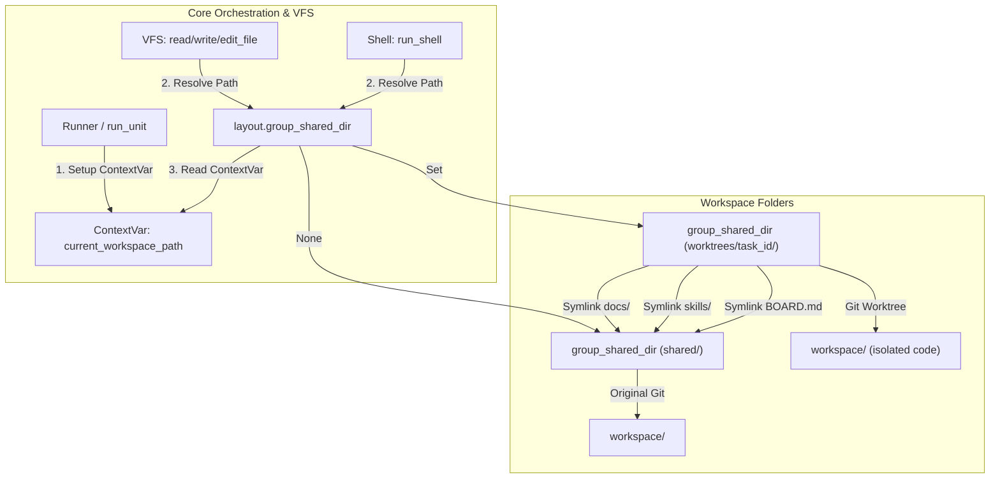

# Git Worktree Sandboxing Architecture & Implementation Review

This document provides a comprehensive overview of the **Git Worktree Sandboxing** implementation in `nuke-ai-collaborator`. The system isolates individual AI tasks/Jira tickets using lightweight git worktrees to prevent changes from directly affecting the host main branch, merging changes only on explicit user approval (Jira ticket status transitioning to `done`).

---

## 1. System Architecture

The isolation is achieved via **Dynamic Workspace Routing** using Python's `contextvars` context-local storage. This ensures that any file access (VFS reads/writes) or shell executions automatically resolve to the task's worktree sandbox when active, without requiring any modifications to individual tool code.



---

## 2. Key Components Implemented

### A. ContextVar Override (`backend/workspace/layout.py`)
Introduced `current_workspace_path` as a context-local variable. When set, `layout.group_shared_dir(gid)` dynamically overrides the workspace path, redirecting VFS operations and shell commands to the worktree root.
*   **Code Reference**: [layout.py](file:///Users/Nuke/claudeFolder/nuke-ai-collaborator/backend/workspace/layout.py)

### B. Git Worktree Manager (`backend/workspace/git_worktree.py`)
Handles worktree creation, symlinking shared coordination files, sharing dependencies, and promotion (merging) changes.
*   **Creation (`create_worktree`)**: Spins up a git worktree at `workspaces/group_{gid}/worktrees/task_{task_id}/workspace`. It dynamically handles empty workspaces by initializing git configuration on demand.
*   **Resource Symlinking (`link_shared_resources`)**: Symlinks `docs/`, `skills/`, `prs/`, `BOARD.md`, and `SPEC.md` back to the group's main shared directory.
*   **Dependency Sharing (`link_dependencies`)**: Recursively scans the parent workspace for virtual environments (`venv`, `.venv`) and `node_modules`, symlinking them to the task directory to prevent package reinstall overhead.
*   **Promotion (`promote_worktree`)**: Automatically commits any uncommitted task changes to the worktree branch, checks out the target branch (`main`), performs a `git merge`, and cleans up the worktree branch.
*   **Context Manager (`use_worktree`)**: Context manager that binds the active execution to the worktree.
*   **Code Reference**: [git_worktree.py](file:///Users/Nuke/claudeFolder/nuke-ai-collaborator/backend/workspace/git_worktree.py)

### C. Execution Hook (`backend/core/runner.py`)
Extracted the `ticket_id` from the `WorkUnit` and wrapped the execution block in `use_worktree` when present.
*   **Code Reference**: [runner.py](file:///Users/Nuke/claudeFolder/nuke-ai-collaborator/backend/core/runner.py)

### D. Promotion Hook (`backend/integrations/jira.py`)
Listens to Jira ticket status changes. When a ticket status transitions to `"done"` (representing completion and user approval), it invokes `promote_worktree`.
*   **Code Reference**: [jira.py](file:///Users/Nuke/claudeFolder/nuke-ai-collaborator/backend/integrations/jira.py)

---

## 3. Test Verification

We implemented a robust test suite in [test_git_worktree_sandbox.py](file:///Users/Nuke/claudeFolder/nuke-ai-collaborator/backend/tests/test_git_worktree_sandbox.py) to cover all functional requirements:

1.  **Worktree Lifecycle**: Verified that `create_worktree` sets up directories and symlinks correctly, and `remove_worktree` cleans them up.
2.  **Dependency Sharing**: Verified that heavy directories (such as `node_modules`) inside project subdirectories are correctly symlinked to preserve package state.
3.  **VFS Path Redirection & Isolation**: Verified that writing to `workspace/src/foo.py` inside the context manager writes to the worktree, while the main shared directory remains untouched.
4.  **Promotion (Merge)**: Verified that promotion successfully merges files created under the worktree back into the main branch.
5.  **Jira Integration**: Verified that changing ticket status to `"done"` automatically triggers promotion.

### Test Results

All tests have passed successfully:
```bash
$ PYTHONPATH=backend python3 -m pytest backend/tests/test_layout.py backend/tests/test_workspace_redirect.py backend/tests/test_git_worktree_sandbox.py
============================= test session starts ==============================
collected 18 items

backend/tests/test_layout.py ........                                    [ 44%]
backend/tests/test_workspace_redirect.py ...                             [ 72%]
backend/tests/test_git_worktree_sandbox.py .....                         [100%]

======================== 18 passed, 1 warning in 3.21s =========================
```
