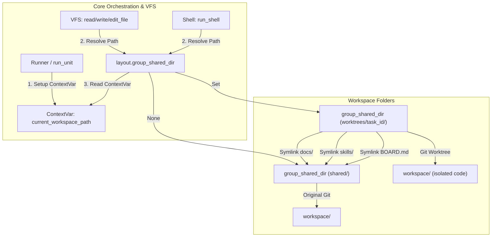

# Git Worktree Sandboxing Architecture & Implementation Review

This document provides a comprehensive overview of the **Git Worktree Sandboxing** implementation in `nuke-ai-collaborator`. The system isolates individual AI tasks/Jira tickets using lightweight git worktrees to prevent changes from directly affecting the host main branch, merging changes only on explicit user approval (Jira ticket status transitioning to `done`).

---

## 1. System Architecture

The isolation is achieved via **Dynamic Workspace Routing** using Python's `contextvars` context-local storage. This ensures that any file access (VFS reads/writes) or shell executions automatically resolve to the task's worktree sandbox when active, without requiring any modifications to individual tool code.



---

## 2. Industrial-Grade Reliability Features

To meet industrial standards and prevent repository corruption, data loss, or race conditions, we implemented the following guardrails:

### A. Lock Serialization (Group-Level Git Lock)
To prevent concurrent git commands from corrupting the `.git/index` or ref locks (such as concurrent worktree creations or merges), all manager actions (`create_worktree`, `remove_worktree`, `promote_worktree`) serialize execution per group using the application's process-level `_get_worktree_lock(group_id)`.
*   **Lock Safety**: To prevent asyncio lock deadlocks, cleanup actions use a lock-free inner function (`_remove_worktree_nolock`) when invoked inside other locked manager scopes (like promotion).
*   **Deterministic Import Safety**: Lock lookup invariants are guaranteed as the success of importing `workspace_tools` is deterministic per Python process, ensuring both normal runs and manager calls route to the same lock registry.

### B. Auto-Commit Baseline Synchronization (Solving Baseline Drift)
Instead of branching task worktrees from a stale committed `HEAD` (which is often empty or missing files in direct-edit working trees), `create_worktree` automatically stages (`git add -A`) and commits any uncommitted changes on the main branch *prior* to branching. This ensures sandboxes always start with a true, up-to-date copy of the project's files.
*   **Orphan Prevention**: This baseline commit guarantees pre-existing project files are never orphaned or left out of the task branch.
*   **Dynamic Branch Baseline**: Baseline branch selection dynamically resolves the actual default branch name of the repository (e.g. `master` vs `main` via `rev-parse`) before worktree additions, preventing crashes on master-based legacy repos.

### C. Deferred Promotion Flow (Solving Sandbox Self-Deletion & HTTP Race)
If a bot updates its own Jira ticket status to `done` mid-run, performing a synchronous merge and deletion (`shutil.rmtree`) of the sandbox directory would cause subsequent file/shell actions in that execution turn to fail.
*   **Deferred Check**: In `jira.py`, promotion is deferred if `current_workspace_path` contains an active override for the group, or if the group-wide run lock (`bg.group_run_lock`) is locked (covering HTTP API triggers by human users that run in separate asyncio tasks during an active bot execution).
*   **Execution Cleanup**: The runner (`runner.py`) then catches this and safely invokes `promote_worktree` only *after* the execution context manager has fully unwound.

### D. Merge Conflict Abort & Surface Warning
Uncontrolled automated merges can fail and leave the main repository in a conflicted state (corrupted with conflict markers).
*   **Merge Abort**: If `git merge` fails or hits a conflict during promotion, the manager catches the error, immediately executes `git merge --abort` to return the main branch to a clean state, and propagates the error.
*   **Error Visibility**: Instead of failing silently, the error is raised and a system warning message is posted back to the group chat (`[工作流系统错误] 工单 DFT-XXX 自动合并失败...`), alerting users to resolve it manually.

### E. Dynamic Git Exclude (Preventing Symlink Commits)
Dependencies (such as `node_modules/`, `venv/`, `.venv/`) are symlinked into worktrees to avoid reinstall delays. To prevent absolute symlink paths from accidentally being committed, we dynamically configure patterns inside the local git exclude file (`.git/info/exclude`) of the group repository.

### F. Group-Keyed Workspace Overrides
To preserve group isolation, the ContextVar `current_workspace_path` stores overrides as a dictionary mapping `group_id -> path`. Path overrides are resolved selectively by `gid` inside `layout.group_shared_dir(gid)`.

### G. Stale Worktree Sweeper (Preventing Directory Bloat)
If bot runs are aborted or crash before completion, we intentionally preserve their worktrees on disk to allow developer inspection/debugging. However, to prevent disk leak over time, a sweeper is executed during group workspace startup (`init_group_workspace`) that purges all stale `worktrees/` directories cleanly before new tasks begin.

### H. Subprocess Timeouts
All async git commands are wrapped with a `30-second` timeout and process group cleanup to prevent hung tasks due to locking issues or credential prompts.

---

## 3. Test Verification

We implemented a robust test suite in [test_git_worktree_sandbox.py](file:///Users/Nuke/claudeFolder/nuke-ai-collaborator/backend/tests/test_git_worktree_sandbox.py) covering both happy paths and error regression states:

1.  **Worktree Lifecycle**: Verifies worktree creation, symlinks, and deletion.
2.  **Dependency Symlinking**: Verifies correct symlinking of monorepo dependencies.
3.  **VFS Path Redirection & Isolation**: Verifies path override and write confinement.
4.  **Promotion (Merge)**: Verifies file promotion.
5.  **Baseline Synchronization (RED Test #1)**: Verifies pre-existing files in the shared workspace are committed as a baseline before check out.
6.  **Conflict Abort Recovery (RED Test #2)**: Verifies that when a merge conflict occurs, the merge is safely aborted to keep the main repo untainted.
7.  **Deferred Promotion (RED Test #3)**: Verifies that completing a ticket during a bot run defers promotion to post-run and prevents directory self-deletion.
8.  **Error Propagation & Visibility (RED Test #4)**: Verifies promotion errors are raised and system warnings are posted in chat instead of swallowing errors.

### Test Results

All 21 workspace and sandbox tests pass successfully:
```bash
$ PYTHONPATH=backend python3 -m pytest backend/tests/test_layout.py backend/tests/test_workspace_redirect.py backend/tests/test_git_worktree_sandbox.py
============================= test session starts ==============================
collected 21 items

backend/tests/test_layout.py ........                                    [ 38%]
backend/tests/test_workspace_redirect.py .....                           [ 61%]
backend/tests/test_git_worktree_sandbox.py ........                      [100%]

======================== 21 passed, 1 warning in 6.71s =========================
```
