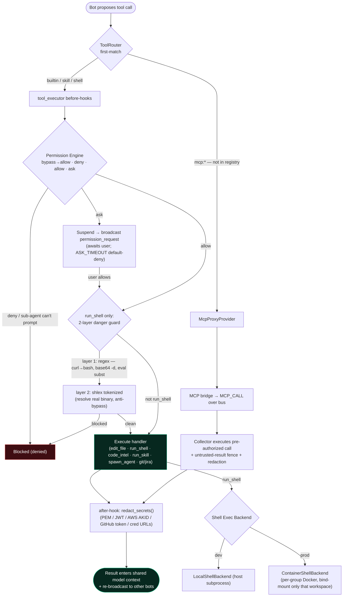

# Nuke AI Collaborator System Architecture Diagram

This document contains a comprehensive system architecture diagram representing the **Nuke AI Collaborator** project. It details the multi-process sharding structure, internal modules, communication protocols, and sandboxed storage boundaries.

> **Process topology at a glance** — there are **three** process roles, not two:
> ```
> main.py / runtime.entry --role supervisor   (FastAPI + WS gateway, the bus)
>     ├── Worker × N        (runtime.entry --role worker)   ← runs the AI tool-loop per group shard
>     └── MCP Collector × 1 (runtime.mcp_collector)         ← sole owner of all MCP server connections
> ```
> The Supervisor is the bus: it relays `MCP_CALL`/`MCP_RESULT`/`MCP_SCHEMAS` between Workers and the single Collector, so MCP is a shared capability instead of being re-spawned inside every Worker.

## 1. Visual System Architecture Diagram

```mermaid
graph TB
  %% Client / Browser Tier
  subgraph ClientTier["Client / Browser Tier (React Web UI)"]
    UI["Web Chat UI (React)"]
    VFSExplorer["VFS File Explorer"]
    Dash["Metrics Dashboard"]
    WSClient["WebSocket client (WSRPC Proxy)"]
  end

  %% Supervisor Process (Gateway & Router)
  subgraph SupervisorProc["Supervisor Process (FastAPI Coordinator)"]
    WSRouter["FastAPI WS Router"]
    BrowserReg["Browser Registry (_browsers[group_id])"]
    RoutingCache["Routing Cache (Memory + SQLite)"]
    SubprocCtrl["Subprocess Controller (_spawn_workers)"]
  end

  %% Worker Process (Compute Shard - One per active Session Group)
  subgraph WorkerProc["Worker Process (Compute Shard)"]
    AsyncioLoop["asyncio Event Loop (downstream/upstream pumps)"]
    LCM["Lifecycle Manager (hydrate / evict)"]
    GroupLock["Group Lock (fcntl.flock / msvcrt)"]
    EventBus["Internal Event Bus (Wildcard Pub/Sub)"]

    subgraph AgentOrch["Agent Orchestrator (tool_loop_v1 + role_router)"]
      Swarm["Agent Swarm (BA / Dev / QA Bots)"]
      Traits["Trait Stitcher (system/traits)"]
      Skills["Skill Lazy-Loader (SOP Discovery)"]
      RoleRouter["Role Router (keyword-family auto-trigger)"]
      Compact["AutoCompact (5-strategy context pipeline)"]
    end

    subgraph ToolLayer["Tool Router & Security Layer"]
      ToolRouter["ToolRouter (first-match provider aggregator)"]
      ToolExec["tool_executor (registry + before/after hooks)"]
      Perm["Permission Engine / HIL gate (allow·deny·ask)"]
      ShellGuard["run_shell Guard (regex + shlex tokenized)"]
      Redact["Secret Redaction (PEM/JWT/AWS/GitHub)"]
      McpProxy["McpProxyProvider (forwards to Collector)"]
      CodeIntel["Code Intelligence (jedi / LSP, ext-routed)"]
    end

    subgraph EditEngine["Edit Engine (normalize.py)"]
      Replacer["9-Tier Replacer Ladder"]
      OffsetCalc["Batch Offset Calculator"]
      UniqueLock["Equivalence Class Lock"]
      HashAnchor["hashline Anchor (SHA-256)"]
      SearchEngine["Custom ripgrep Parser (mtime desc)"]
    end

    Memory["Memory / Knowledge (Chroma + salience facts)"]
    AIClient["AI Client (DeepSeek/OpenAI/Anthropic/Ollama)"]
  end

  %% MCP Collector Process (single, cross-group)
  subgraph CollectorProc["MCP Collector Process (single, cross-group)"]
    McpClients["McpClientToolProvider × N (stdio / remote)"]
    OAuthStore["MCP OAuth Token Store"]
    DescKill["Descendant Process Sweeper (npx/node orphans)"]
  end

  %% Scheduler (Supervisor-side)
  Scheduler["APScheduler (cron → wake_trigger)"]

  %% Storage Sandbox / OS Filesystem
  subgraph StorageSandbox["Sandbox & Storage Tier (Per-Group Folder)"]
    GroupDB["Group Database (group_N.db WAL)"]
    CentralDB["Central DB (users / groups / members)"]
    LockFile["Group Lease Lock (group.lock)"]
    VFSWork["Workspace Directory (workspaces/group_N)"]
    RecapFile["Recap & Eviction Shield (RETRO_LATEST.md)"]
    Chroma["Chroma Vector Store (per-group memories)"]
    Container["Per-Group Sandbox Container (Docker, mount-isolated)"]
  end

  %% External services
  subgraph External["External Services"]
    LLMs["LLM APIs (DeepSeek / OpenAI / Anthropic / Ollama)"]
    MCPServers["MCP Servers (stdio / remote)"]
    DevTools["Git / Jira"]
  end

  %% Connections & Protocols
  UI --> WSClient
  VFSExplorer --> WSClient
  Dash --> WSClient

  %% WSRPC over WS
  WSClient <== "WSRPC (JSON Frame over WebSocket)" ==> WSRouter

  %% Supervisor internal routing
  WSRouter --> BrowserReg
  WSRouter --> RoutingCache
  %% Control plane: one-time process lifecycle (dotted). Supervisor forks the
  %% child; the child then connects BACK over IPC (data plane below).
  SubprocCtrl -. "spawns (lifecycle)" .-> AsyncioLoop
  SubprocCtrl -. "spawns (lifecycle)" .-> McpClients
  Scheduler -->|wake_trigger| WSRouter

  %% Data plane: long-lived bidirectional IPC channel (child connects in via HELLO)
  WSRouter <== "runtime data — IPC (JSON Length-Framed over UDS / Pipes)" ==> AsyncioLoop
  WSRouter <== "runtime data — MCP_CALL / MCP_RESULT / MCP_SCHEMAS (bus relay)" ==> McpClients

  %% Worker loop internal actions
  AsyncioLoop --> LCM
  LCM -->|flock| LockFile
  LCM -->|Mount DB| GroupDB
  AsyncioLoop --> EventBus
  AsyncioLoop --> AgentOrch

  %% Agent execution & tooling
  Swarm -->|Publishes Events| EventBus
  RoleRouter -->|selects bots| Swarm
  Swarm -->|every tool call| ToolRouter
  Swarm -->|Loads Traits| Traits
  Swarm -->|Lazy Load Skill| Skills
  Swarm -->|context overflow| Compact
  Swarm -->|inference| AIClient
  AIClient -->|HTTPS / stream| LLMs

  %% Tool dispatch + security
  ToolRouter -->|builtin/skill/shell| ToolExec
  ToolRouter -->|mcp:*| McpProxy
  ToolExec -->|before-hook| Perm
  ToolExec -->|run_shell before-hook| ShellGuard
  ToolExec -->|after-hook| Redact
  ToolExec -->|edit_file / write_file| EditEngine
  ToolExec -->|run_shell| Container
  ToolExec -->|code_intel| CodeIntel
  Perm -->|ask → permission_request| EventBus
  McpProxy <== "MCP_CALL via bridge" ==> McpClients

  %% Collector internals
  McpClients -->|stdio / remote| MCPServers
  McpClients --> OAuthStore
  McpClients --> Redact

  %% Memory + knowledge
  Swarm -->|recall / save fact| Memory
  Memory -->|embed + upsert| Chroma
  Memory -->|metadata| GroupDB

  %% Edit Engine file writes
  EditEngine -->|rg search| SearchEngine
  SearchEngine -->|Scan filesystem| VFSWork
  EditEngine -->|Anchored edit| HashAnchor
  EditEngine -->|Apply Patch| Replacer
  Replacer -->|Safe write| VFSWork
  Container -->|bind-mount| VFSWork

  %% Dev-tool integrations
  ToolExec -->|create_pr / *_jira_ticket| DevTools

  %% Events upstream flow
  EventBus -->|Pump Events| AsyncioLoop

  %% Eviction Sync
  LCM -->|serialize| GroupDB
  LCM -->|Write Recap| RecapFile

  %% Styles
  classDef client fill:#0b132b,stroke:#3a86c8,stroke-width:2px,color:#f8fafc;
  classDef supervisor fill:#1c1a27,stroke:#8b5cf6,stroke-width:2px,color:#f8fafc;
  classDef worker fill:#07281f,stroke:#10b981,stroke-width:2px,color:#f8fafc;
  classDef storage fill:#3b1e08,stroke:#fbbf24,stroke-width:2px,color:#f8fafc;
  classDef agent fill:#2e1065,stroke:#c084fc,stroke-width:2px,color:#f8fafc;
  classDef engine fill:#0f172a,stroke:#38bdf8,stroke-width:2px,color:#f8fafc;
  classDef security fill:#3f0d12,stroke:#f87171,stroke-width:2px,color:#f8fafc;
  classDef collector fill:#0c2433,stroke:#22d3ee,stroke-width:2px,color:#f8fafc;
  classDef external fill:#1a1a1a,stroke:#94a3b8,stroke-width:2px,color:#f8fafc;

  class UI,VFSExplorer,Dash,WSClient client;
  class WSRouter,BrowserReg,RoutingCache,SubprocCtrl,Scheduler supervisor;
  class AsyncioLoop,LCM,GroupLock,EventBus,Memory,AIClient worker;
  class Swarm,Traits,Skills,RoleRouter,Compact agent;
  class ToolRouter,ToolExec,Perm,ShellGuard,Redact,McpProxy,CodeIntel security;
  class McpClients,OAuthStore,DescKill collector;
  class Replacer,OffsetCalc,UniqueLock,HashAnchor,SearchEngine engine;
  class GroupDB,CentralDB,LockFile,VFSWork,RecapFile,Chroma,Container storage;
  class LLMs,MCPServers,DevTools external;
```



---

## 2. Core Architectural Features Breakdown

### A. The Supervisor-Worker Process Model
*   **The Supervisor Process**: Acts as the single entrance coordinator. It manages incoming WebSocket connections, coordinates active group mappings, and launches or kills worker processes. It is optimized to perform pure packet shunting and routing to shield the WebSocket gateway from CPU-intensive AI workloads.
*   **Worker Process Shards**: Each active session group runs inside its own isolated Python worker subprocess. This isolates memory leaks and provides basic security boundaries between projects. Workers use `asyncio` to execute agentic loops and tool calls.
*   **IPC Channel**: Main-sub communications occur over Unix Domain Sockets (UDS) on Linux/macOS and Named Pipes on Windows. Messages are packetized into lengths and JSON frames (payloads prefixing a 4-byte big-endian length header), achieving **sub-millisecond** round-trip latency (~0.1ms avg; reproduce with `backend/benchmark_ipc.py` — a 1000-message ping/pong over the UDS).

### B. Sandboxed Group Storage
*   **Group private database (`group_N.db`)**: Every group maintains its SQLite database in WAL (Write-Ahead Logging) mode (`PRAGMA journal_mode = WAL`), which enables concurrent readers without blocking writes.
*   **Group lock (`group.lock`)**: A lock file utilizing OS-level locking APIs (Posix `flock` / Windows `msvcrt.locking`) prevents multiple worker processes from mounting the same SQLite database or workspace concurrently, solving split-brain concurrency issues.
*   **LRU Lifecycle Eviction**: Active sessions are cached in memory. Inactive workers are automatically evicted. During eviction, workers serialize their state to SQLite, write out a project recap to `RETRO_LATEST.md` with write protection, release the lock file, and terminate gracefully.

### C. The Resilient Edit Engine
*   **Coordinate mapping (`normalize.py`)**: Resolves discrepancies in line endings, quotation styles, and tab indents between model proposals and code files. It maintains character index maps in both raw and normalized coordinate spaces to ensure correct disk writes.
*   **9-Tier Replacer Ladder**: An ordered cascade of exactly 9 replacers (`replacers.REPLACERS`) escalating from strict character matches → quote/escape normalization → relative-indentation → line/boundary trimming → whitespace-normalized → `difflib` similarity-ratio fuzzy matching → block-anchor, protecting code modifications from minor formatting noise.
*   **Equivalence Class Lock**: Aborts fuzzy edits if a relaxed tier matches more than one location in the file, preventing silent code corruption.
*   **hashline Anchoring**: Indexes lines with SHA-256 hashes. Even if line numbers shift due to insertions elsewhere, edits reference stable hash coordinates.

---

## 3. Tool Execution & Security Pipeline

Every tool call a bot makes flows through one funnel. `ToolRouter` is **first-match**: builtin / skill / shell tools stay on `tool_executor.execute()` so the global before/after hooks (the *single* interception point) always fire; only MCP tools (which are **not** in `tool_executor`'s registry) route to the proxy and across the bus to the Collector.



---

## 4. Additional Subsystems (Code-Verified)

### D. MCP Collector Process (single, cross-group)
*   **Why one process**: an MCP connection's `anyio` cancel scope is bound to the task that created it; sharing it across processes/tasks raises `RuntimeError`. So **all** MCP server connections live in exactly one Collector (`runtime/mcp_collector.py`), never re-spawned per worker.
*   **Bus relay**: the Collector connects to the Supervisor like a worker (`HELLO` with `worker_id = MCP_COLLECTOR_ID`). Workers send `MCP_CALL` upstream; the Supervisor relays to the Collector and the `MCP_RESULT` back. The Collector pushes a `MCP_SCHEMAS` snapshot on startup and on every `ToolListChanged` (cheap diff re-push, ~10 s), and the Supervisor caches the latest snapshot so a late-joining worker still gets the current tool set.
*   **Trust boundary**: permission/HIL runs on the **worker** side *before* a call is sent; the Collector only executes pre-authorized calls (`_pre_authorized=True`), then applies the untrusted-result fence + secret redaction before results cross back.
*   **OAuth**: `mcp_auth_flows` / `mcp_oauth_store` handle `MCP_AUTH_START` with a per-server in-flight guard; callback uses `PUBLIC_BASE_URL`.
*   **Cleanup**: on shutdown the Collector hard-kills orphaned descendants (e.g. an `npx` launcher's `node` grandchild) via a process-tree SIGTERM→SIGKILL sweep.

### E. Tool Router & Security Layers
*   **ToolRouter (`executors/tool_router.py`)**: first-match aggregator over registered providers (`McpProxyProvider` + `BuiltinToolProvider` catch-all). It does **not** add a second hook layer and does **not** replace `tool_executor`.
*   **Single interception point**: `tool_executor`'s before/after hooks are the only place permission + shell-guard + redaction fire. The `ShellToolProvider` is deliberately **left unregistered** — registering it would let `run_shell` match a hook-bypassing path (fail-open regression).
*   **Permission Engine / HIL (`permissions/engine.py`)**: pipeline = `bypassPermissions → deny → allow → dontAsk → sub-agent-deny → ask(suspend+broadcast) → default-allow`. Unanswered `ask` default-denies after `ASK_TIMEOUT_SECONDS`; `once` grants are scoped to `(bot_id, group_id)` and consumed by one matching call.
*   **Sub-agent attenuation (`derive_subagent_ruleset`)**: `bypassPermissions` never propagates downward; blanket high-risk allow rules are dropped for spawned sub-agents.
*   **run_shell danger guard (2 layers, `workspace_tools.py`)**: layer 1 regex blocks classic obfuscation (`base64 -d`, `curl|wget … | bash`, `eval $(…)`/backticks); layer 2 `shlex`-tokenizes to resolve the real binary so quoting/escaping can't smuggle a blocked command past layer 1. Sensitive dirs (`.ssh`, `.aws`, `.docker`, `.gnupg`, `.kube`, `.password-store`) are also guarded.
*   **Secret redaction (`executors/redaction.py`)**: high-precision masking of PEM blocks, JWTs, AWS AKIDs, GitHub tokens, credentialed URLs, secret-named assignments. Applied at two choke points — `tool_executor` after-hook (builtin/shell/skill) and the MCP provider (results that bypass `tool_executor`). Multi-agent context is a leak amplifier, so this runs before any result is shared/re-broadcast.

### F. Sandboxed Execution Backends
*   **Seam (`shell_backend.py`)**: `_handle_run_shell` builds a normalized `ShellExecRequest` and hands it to a `ShellExecBackend`, which decides isolation strength.
*   **LocalShellBackend**: host subprocess, **no** cross-group isolation — dev only.
*   **ContainerShellBackend (`container_sandbox.py`)**: one long-lived `sleep infinity` Docker container **per active group**; the worker `docker exec`s commands in. Isolation is by **mount** — only that group's workspace is bind-mounted (same host path), so sibling groups / central DB / host secrets are absent from the container. In-container `timeout` (exit 124) kills the real process. Gated by `NUKE_SHELL_EXEC_BACKEND=container`. (Windows: `win_sandbox.py`.)

### G. Memory / Knowledge Base (per-group)
*   **Vector store (`ai/memory.py` + `ai/embeddings.py`)**: each group's accumulated facts live in a **Chroma** collection, embedded via the configured embeddings provider — this is what lets a group's bots be "the members who know the project best."
*   **Salience-scored fact extraction**: an LLM filter pulls durable facts (decisions / preferences / config changes / conclusions) from agent turns, scoring each `0.0–1.0`; small talk and transient tool errors are dropped (`NO_SALIENT_INFO`). Metadata lives in the group DB, vectors in Chroma; strictly per-group (no cross-group recall).

### H. AutoCompact Pipeline (`executors/compact.py`)
Five strategies run per turn (modeled on Claude Code's `autoCompact.ts`): (1) tool-result microcompact, (2) snip oldest user/assistant pair, (3) `auto_compact_if_needed` — reuse existing 【历史摘要】 first, else a 9-section structured AI summary, (4) cached microcompact (Claude provider), (5) post-run `maybe_compact_db_history` (soft-delete old DB messages + persist summary). Hardened against `PROMPT_TOO_LONG` with bounded retry that drops the oldest round.

### I. Code Intelligence (`executors/code_intel/`)
The model picks the *capability* (definition / references / …) via the `code_intel` tool; `router.py` picks the *engine* by file extension: **jedi** (in-process) for Python, **typescript-language-server** over LSP/stdio for JS/TS. Unsupported/unavailable language → returns `None` so the tool tells the model to fall back to the textual `search` tool. Java and others stay on text-search by design.

### J. Multi-Provider AI Client (`ai/client.py`)
One process-wide pooled `httpx.AsyncClient` (keep-alive reuse) fronts **DeepSeek**, **OpenAI**-compatible, **Anthropic**, and **Ollama** backends, with streaming, `tenacity` retry/backoff, and per-model token limits / pricing (`model_limits.py`, `pricing.py`).

### K. Orchestration & Role Routing
*   **role_router (`core/role_router.py`)**: maps a free-form role string to a family (BA / Dev / QA, EN+ZH) and auto-triggers a bot (no @mention needed) when a message hits that family's keywords.
*   **Orchestration (`core/orchestration/`)**: pluggable multi-bot pipelines (`round_robin`, `discussion`) over a stage/interaction model; `tool_loop_v1` is the per-bot agentic loop. R&D signalling tools (`signal_stage_done` / `signal_rework`) drive stage transitions.

### L. IPC & Bus
*   **IPC (`runtime/ipc/`)**: length-framed JSON (4-byte big-endian header) over UDS/pipes (`transport_unix` / `transport_win`); `protocol.py` defines frame types — `HELLO`, `BROADCAST`, `UNREAD_DELTA`, `STATS_REPORT`, `MCP_CALL/RESULT/SCHEMAS`, `MCP_AUTH_*`, `permission_request/response`, `wake_trigger`, `abort`.
*   **Event bus (`bus/`)**: per-process wildcard pub/sub singleton; a worker's bus events are wrapped as `broadcast` frames and pumped upstream to the Supervisor, which fans out to every browser registered for the group and folds `UNREAD_DELTA` into the central unread projection (Supervisor is the sole writer).

### M. Scheduler (`scheduler/`)
An in-process APScheduler (`AsyncIOScheduler`, cron triggers) on the Supervisor side fires `wake_trigger` frames into groups on schedule, letting bots run autonomously without a human message.

### N. Schema Splitting & Logical References (`db/schema_split.py`)
*   **Domain Isolation (CELL-05)**: The database is physically split into a single central coordinator database (`central.db`) and separate private databases per active group (`group_{id}/chat.db`).
    *   **Central Domain Tables**: `users`, `groups`, `members`, `role_templates`, `permission_rules`, `cron_jobs`, and `unread_counts`.
    *   **Group Domain Tables**: `messages`, `role_summaries`, `message_embeddings`, `member_read`, `message_reactions`, `pinned_messages`, `agent_sessions`, `session_events`, `workflow_state`, `group_locks`, `tickets`, and `reflection_state`.
*   **App-Enforced Logical Foreign Keys**: Since SQLite cannot enforce physical `FOREIGN KEY` constraints across separate database files, cross-domain constraints (such as `messages.member_id` referencing the central `members.id`, or `workflow_state.group_id` referencing `groups.id`) are dropped at the SQL level. They are maintained as plain integer columns and logically enforced in the application layer. Single-database constraints (like reactions-to-messages or session_events-to-agent_sessions) are kept as standard SQL constraints.
*   **Direct Final Schema Stamp**: Fresh per-domain databases are initialized directly at the final schema shape (with all historical migrations pre-inlined) to bypass replaying mixed-domain migrations on a split database structure.

### O. Serialized Single-Writer Channel (`db/writer.py`)
*   **Anti-Lockup Queueing (DFT-053)**: To eliminate SQLite `database is locked` operational errors under heavy parallel writes, all database writes for a specific database path are routed through a single shared `aiosqlite` connection guarded by a process-wide `asyncio.Lock`.
*   **Double Keying**: The writer connection pool is keyed by a `(event_loop_id, db_path)` tuple. This ensures that a single worker sub-process can manage writers to multiple group databases without contention, and isolates unit tests running on separate loops.
*   **Thread Cleanup Sentinel**: A `weakref.finalize` hook is bound to the running asyncio loop. When a loop is garbage collected (or a worker process shuts down), stale write connections are closed. To prevent thread blocks during eviction, the writer threads are explicitly marked as daemonic (`conn.daemon = True`).

### P. Nested Workspace Layout (`workspace/layout.py`)
*   **Single Layout Truth (Phase 2)**: All bot-accessible disk locations are computed dynamically by a single module to eliminate duplicate definitions. Workspaces are physically structured in a nested hierarchy:
    *   **Group Root (`group_{gid}/`)**: The top-level sandbox directory for a collaboration session.
    *   **Shared Workspace (`group_{gid}/shared/`)**: The main collaborative workspace directory where shared source code, BOARD.md task boards, and project outputs are located.
    *   **Bot Private Workspaces (`group_{gid}/bots/bot_{id}/`)**: Private scratch directories for each bot. This isolates their temporary scripts, workspace logs, and transient work files from one another, preventing command execution conflicts.
    *   **Runs Directory (`group_{gid}/runs/`)**: Segregated folder storing outputs, test results, and logs from execution runs.

### Q. WebSocket Gateway & Concurrency Defense (`ws_manager.py`)
*   **Re-entrancy & Thread-Safety Lock (DFT-047)**: To protect the `self.connections` registry from concurrent modification or re-entrant coroutine mutation, all mutations (connection joins/leaves) are guarded by an asynchronous `asyncio.Lock`. A connection snapshot is taken under the lock to iterate safely during broadcasts.
*   **Head-of-Line Blocking Defense (DFT-030)**: Stalled or slow browser connections (e.g., due to a half-open TCP connection) can block sequential event loops indefinitely. The manager wraps client broadcasts in an `asyncio.wait_for` timeout guard (`WS_SEND_TIMEOUT`).
*   **Parallel Broadcast Execution**: To ensure real-time responsiveness under high throughput, broadcasts are fanned out concurrently using `asyncio.gather(*[...], return_exceptions=True)`. Dead connections that time out or throw errors are immediately evicted from the registry to maintain health.


